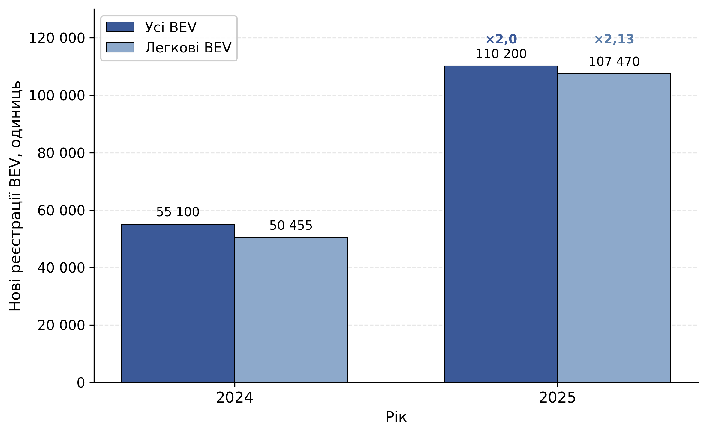

### 1.1.2. Сучасний стан і перспективи розвитку зарядної інфраструктури електромобілів

Розвиток електромобільного транспорту є одним із ключових напрямів декарбонізації світової економіки. За даними звіту «Global EV Outlook 2025» Міжнародного енергетичного агентства, у 2024 році світові продажі електромобілів перевищили 17 млн одиниць, що становить близько п'ятої частини всіх проданих того року нових легкових автомобілів [@noauthor_executive_nodate]. Паралельно вдосконалюються акумуляторні технології, силова електроніка зарядних станцій та засоби інтеграції з електромережею [@sarda_review_2024]. Проте темпи розгортання публічної зарядної інфраструктури відстають від зростання парку електромобілів, що зумовлює потребу в науково обґрунтованих рішеннях щодо її просторового планування.

Європейський Союз закріпив зобов'язання щодо розгортання інфраструктури альтернативних видів палива у Регламенті (ЄС) 2023/1804 (AFIR – Alternative Fuels Infrastructure Regulation) [@noauthor_regulation_2023]. Для задачі міського розміщення станцій визначальною є вимога за обсягом парку (*fleet-based*): мінімальна публічна зарядна потужність встановлюється пропорційно до кількості зареєстрованих електромобілів – 1,3 кВт на один легковий електромобіль з акумуляторною батареєю (Battery Electric Vehicle, BEV). Регламент містить також вимоги щодо відстані між зарядними майданчиками, проте вони стосуються міжміських магістральних коридорів і для міського контексту є дотичними [@noauthor_regulation_2023].

Гармонізація національного законодавства з AFIR є передумовою інтеграції України в європейський транспортний простір. Український ринок електромобілів демонструє швидке зростання: станом на 2025 рік в Україні зареєстровано понад 110 200 електромобілів – удвічі більше, ніж у 2024 році; з них 107 470 одиниць – легкові автомобілі, що у 2,13 раза перевищує рівень попереднього року. Частка електромобілів у продажах нових легкових автомобілів зросла з 14,5 % до 28,3 % [@forbes_rynok_2026]. Динаміку реєстрацій електромобілів за 2024–2025 роки наведено на рис. 1.1.

Рис. 1.1. Динаміка нових реєстрацій електромобілів в Україні за 2024–2025 роки

Таке зростання парку створює навантаження на національну зарядну інфраструктуру. За орієнтиром AFIR лише легкові електромобілі, зареєстровані у 2025 році, формують потребу приблизно у 140 МВт публічної зарядної потужності (107 470 × 1,3 кВт ≈ 139,7 МВт) без урахування накопиченого парку попередніх років. За умов обмежених капіталовкладень і нерівномірного розподілу попиту вибір локацій для нових станцій стає самостійною управлінською задачею, що вимагає формалізованого багатокритеріального підходу. Це зумовлює потребу проаналізувати наявні програмні та методичні рішення у цій сфері.
