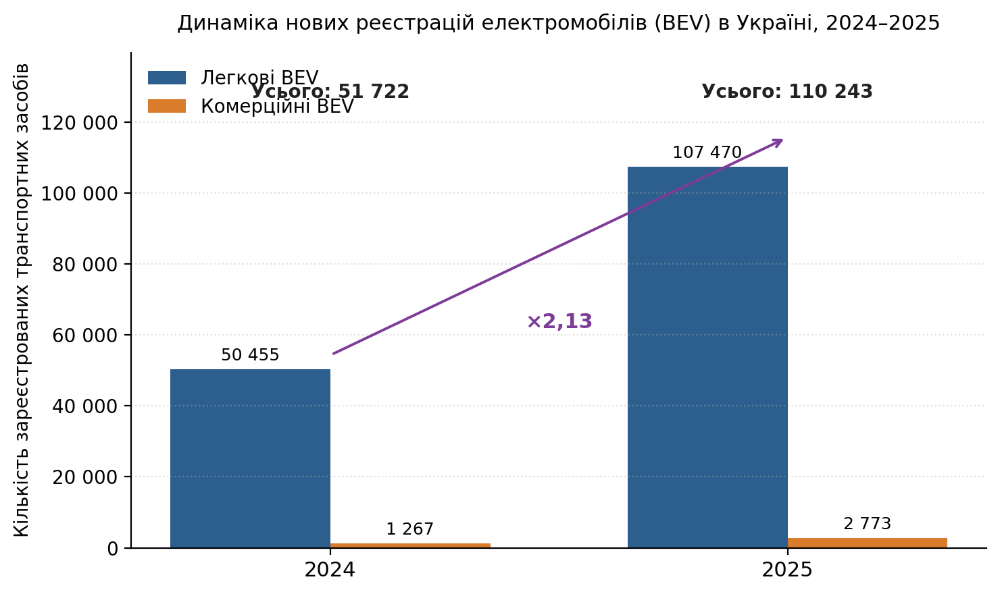

## 1.1.2 Стан та перспективи ринку електромобілів у світі, ЄС та Україні

Перехід до електромобільного транспорту є одним з ключових напрямів декарбонізації світової економіки. За даними щорічного звіту Міжнародного енергетичного агентства *Global EV Outlook 2025*, глобальний обсяг продажів електромобілів у 2024 році перевищив 17 млн одиниць, що становить понад 20 % усіх нових легкових автомобілів, реалізованих у світі [@noauthor_executive_nodate]. Технологічний огляд електромобільної інфраструктури [@sarda_review_2024] фіксує паралельний розвиток трьох ключових елементів: акумуляторних технологій, силової електроніки зарядних станцій та інтеграції з електричною мережею. Проте темпи розгортання публічної зарядної інфраструктури суттєво відстають від темпів зростання парку електромобілів, що формує об'єктивну потребу в науково обґрунтованих рішеннях щодо її просторового планування.

Європейський Союз закріпив зобов'язання щодо розгортання інфраструктури альтернативних видів палива у Регламенті (ЄС) 2023/1804 (AFIR — *Alternative Fuels Infrastructure Regulation*), який набув чинності 13 жовтня 2023 року і застосовується з 13 квітня 2024 року [@noauthor_regulation_2023]. AFIR поєднує два типи зобов'язань: 1) *fleet-based* — пов'язує загальну потужність публічних зарядних станцій з кількістю зареєстрованих електромобілів у державі-члені; 2) *distance-based* — задає максимальну допустиму відстань між зарядними пулами на трансєвропейській транспортній мережі TEN-T (*Trans-European Transport Network*). Ключові цільові показники AFIR для легкового транспорту наведено у таблиці 1.1.

Таблиця 1.1 – Ключові цільові показники Регламенту (ЄС) 2023/1804 (AFIR) для зарядної інфраструктури електромобілів категорії *light-duty*

| Категорія зобов'язання | Цільовий показник | Термін виконання |
|---|---|---|
| Fleet-based, BEV | 1,3 кВт публічної потужності на один зареєстрований легковий BEV | щорічно з кінця 2024 |
| Fleet-based, PHEV | 0,8 кВт публічної потужності на один зареєстрований PHEV | щорічно з кінця 2024 |
| TEN-T core road network | Зарядний пул ≥ 400 кВт із ≥ 1 точкою ≥ 150 кВт; макс. 60 км між пулами | 31.12.2025 |
| TEN-T core road network | Зарядний пул ≥ 600 кВт із ≥ 2 точками ≥ 150 кВт; макс. 60 км | 31.12.2027 |
| TEN-T comprehensive (50 % довжини) | Зарядний пул ≥ 300 кВт із ≥ 1 точкою ≥ 150 кВт | 31.12.2027 |
| TEN-T comprehensive (100 % довжини) | Зарядний пул ≥ 300 кВт із ≥ 1 точкою ≥ 150 кВт | 31.12.2030 |
| TEN-T comprehensive (100 % довжини) | Зарядний пул ≥ 600 кВт із ≥ 2 точками ≥ 150 кВт | 31.12.2035 |

*Джерело: складено за статтями 3 та 4 Регламенту (ЄС) 2023/1804 [@noauthor_regulation_2023].*

Хоча Україна не є членом Європейського Союзу, гармонізація національного законодавства з AFIR є передумовою інтеграції в європейський транспортний простір. Динаміка вітчизняного ринку електромобілів у 2025 році демонструє інтенсивне зростання: зареєстровано понад 110 200 одиниць BEV — у 2,13 раза більше, ніж у 2024 році; частка вживаних електромобілів серед реєстрацій залишається переважаючою (79 %) [@mindua__nodate]. Графічне представлення динаміки нових реєстрацій електромобілів в Україні за 2024–2025 роки наведено на рис. 1.2.

Рис. 1.2. Динаміка нових реєстрацій електромобілів (BEV) в Україні, 2024–2025 (за даними Укравтопрому)

Така динаміка створює суттєвий тиск на національну зарядну інфраструктуру: відповідно до орієнтиру AFIR (1,3 кВт публічної потужності на одне зареєстроване BEV) лише новий парк електромобілів 2025 року потребує понад 140 МВт сукупної публічної зарядної потужності, без урахування накопиченого раніше парку та сегменту вживаних електромобілів, частка яких на ринку залишається переважаючою (79 % реєстрацій 2025 року припадає на імпортовані з пробігом). Це робить задачу раціонального просторового планування зарядних станцій критичною для забезпечення стійкого розвитку електромобільного транспорту в Україні і обґрунтовує актуальність розробки спеціалізованої системи підтримки прийняття рішень для цієї предметної області.
