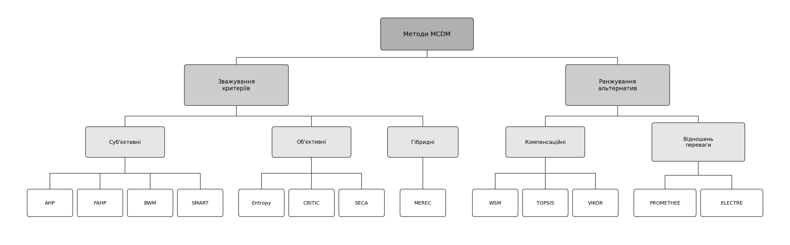

## 1.2. Математичний алгоритм, моделі та методи прийняття рішень для вибору локацій зарядних станцій

Задача вибору локацій зарядних станцій є багатокритеріальною: різнорідні критерії потребують формалізованого механізму зважування, а впорядкування альтернатив за цими вагами – явного правила агрегації. Оскільки наявні методи багатокритеріального прийняття рішень реалізують ці два кроки по-різному, вибір математичного апарату потребує порівняльного аналізу з урахуванням специфіки задачі.

### 1.2.1. Класифікація та порівняльний аналіз методів багатокритеріального прийняття рішень

Згідно з формалізацією задачі MADM, прийнятою в підрозділі 1.1.1, обчислення ранжування розкладається на два послідовні етапи – зважування критеріїв і ранжування альтернатив. Кожен метод обслуговує лише один із цих етапів, тому методи доцільно розглядати як два окремі класи. Узагальнену класифікацію методів обох класів наведено на рис. 1.2.

Рис. 1.2. Класифікація методів MCDM за етапами процедури багатокритеріального прийняття рішень

Дерево на рис. 1.2 поділяє методи спершу за двома етапами процедури, а в межах кожного етапу – за групами зі спільним принципом отримання результату. Належність методу до групи ще не є підставою для його застосування: обґрунтований вибір у кожному класі потребує порівняння методів за характеристиками, істотними для задачі розміщення ЗС.

За способом отримання ваг методи зважування критеріїв поділяють на три групи [@kumar_comprehensive_2025]: суб'єктивні виводять ваги із суджень ОПР, об'єктивні – зі статистичних характеристик матриці рішень, гібридні поєднують обидва джерела. Для обґрунтування вибору зіставлено п'ять найпоширеніших методів класу: суб'єктивні AHP, FAHP і BWM та об'єктивні Entropy і CRITIC [@kumar_comprehensive_2025; @caylor_survey_nodate]. Базовим серед них є метод аналізу ієрархій AHP [@saaty_analytic_2022], який будує ваги з матриці попарних порівнянь критеріїв за дев'ятибальною шкалою, а узгодженість суджень експерта контролює коефіцієнтом узгодженості:

$$
CR = \frac{CI}{RI} = \frac{\lambda_{\max} - m}{(m - 1) \cdot RI}, \tag{1.2}
$$

де
$CR$ – коефіцієнт узгодженості;
$CI$ – індекс узгодженості (Consistency Index);
$\lambda_{\max}$ – максимальне власне значення матриці попарних порівнянь;
$m$ – кількість критеріїв;
$RI$ – випадковий індекс (Random Index) для матриць порядку $m$.

Матрицю вважають прийнятною за $CR \leq 0{,}10$. Похідним від AHP є нечіткий метод FAHP [@chang_applications_1996; @kahraman_fuzzy_2008], у якому кожне попарне порівняння подають не чітким числом, а трикутним нечітким числом (Triangular Fuzzy Number, TFN), що відображає наближений характер експертних суджень. Метод BWM зменшує кількість порівнянь до $2m - 3$, проте у стандартному формулюванні також оперує чіткими числами [@kumar_comprehensive_2025]. Об'єктивні методи Entropy і CRITIC обчислюють ваги без участі експерта – з інформаційної ентропії та з мінливості й кореляції критеріїв відповідно, – тому не відображають пріоритетів ОПР [@kumar_comprehensive_2025]. Зіставлення методів за істотними для задачі характеристиками наведено в табл. 1.2.

Таблиця 1.2. – Порівняльний аналіз методів зважування критеріїв

| Метод | Тип | Кількість порівнянь | Урахування невизначеності | Урахування пріоритетів ОПР | Інтерпретованість для ОПР |
|---|---|---|---|---|---|
| AHP | суб'єктивний | $m(m-1)/2$ | Ні | Так | висока |
| FAHP | суб'єктивний, нечіткий | $m(m-1)/2$ | Так | Так | висока |
| BWM | суб'єктивний | $2m - 3$ | Ні | Так | середня |
| Entropy | об'єктивний | 0 | Ні | Ні | низька |
| CRITIC | об'єктивний | 0 | Ні | Ні | низька |

Аналіз табл. 1.2 показує, що для зважування критеріїв доцільно обрати метод FAHP. Ваги критеріїв мають відображати суб'єктивні пріоритети ОПР, тому об'єктивні Entropy і CRITIC, що визначають ваги лише зі статистики даних, не підходять. Експертні судження про важливість критеріїв мають наближений, лінгвістичний характер: зведення їх до чіткого числа дев'ятибальної шкали приписує оцінці точність, якої вона не має, – цієї невизначеності не зберігають ні AHP, ні BWM. Метод FAHP подає кожне судження трикутним нечітким числом, чим зберігає невизначеність вихідної оцінки, тож одночасно враховує і пріоритети ОПР, і наближеність суджень; такий вибір узгоджується з практикою закордонних досліджень розміщення зарядних станцій [@sani_site_2023; @guler_suitable_2020].

Методи ранжування альтернатив належать до двох методологічних шкіл [@kumar_comprehensive_2025; @lassey_comparative_2025]. Компенсаційні методи (WSM, TOPSIS, VIKOR) зводять оцінки альтернативи за всіма критеріями до однієї скалярної величини, тому низька оцінка за одним критерієм може компенсуватися високою за іншим. Методи відношень переваги (outranking) – PROMETHEE і ELECTRE – порівнюють альтернативи попарно за порогами індиферентності та переваги і допускають неповне впорядкування. Властивості п'яти методів, істотні для вибору, зіставлено в табл. 1.3.

Таблиця 1.3. – Порівняльний аналіз методів ранжування альтернатив

| Метод | Школа | Додаткові параметри налаштування | Тип ранжування | Геометрична інтерпретація | Обчислювальна складність |
|---|---|---|---|---|---|
| WSM | компенсаційна | 0 | повне | середня | $O(nm)$ |
| TOPSIS | компенсаційна | 0 | повне | висока | $O(nm + n \log n)$ |
| VIKOR | компенсаційна | 1 | повне з умовами | середня | $O(nm)$ |
| PROMETHEE II | відношень переваги | $2m$ | повне | низька | $O(n^2 m)$ |
| ELECTRE III | відношень переваги | $\geq 3m$ | часткове | низька | $O(n^2 m)$ |

Зіставлення в табл. 1.3 засвідчує, що основним методом ранжування доцільно обрати TOPSIS [@hwang_multiple_2012] – метод, що впорядковує альтернативи за відстанню до позитивного та негативного ідеальних розв'язків. Вирішальним є те, що він не потребує додаткових параметрів налаштування, кожен такий параметр був би окремим суб'єктивним припущенням, а в задачі, де суб'єктивні переваги вже зосереджено у векторі ваг, він повторно вніс би суб'єктивність і ускладнив би перевірку стійкості результату. За цією ознакою TOPSIS переважає VIKOR і PROMETHEE; ELECTRE до того ж дає лише часткове ранжування, тоді як локації-кандидати потрібно впорядкувати повністю. Від WSM, що так само не має параметрів, TOPSIS відрізняє наочніша геометрична інтерпретація – відстані до ідеальних розв'язків. Повне ранжування і складність $O(nm + n \log n)$ роблять метод придатним для багаторазового виконання в аналізі чутливості. Отже, обчислювальне ядро СППР будують методи FAHP і TOPSIS.
