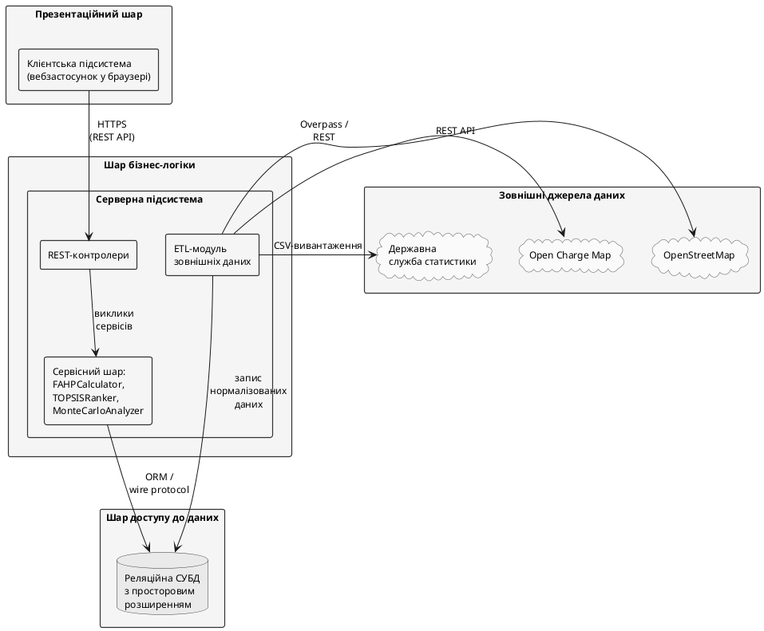

# 2. ПРОЕКТУВАННЯ СИСТЕМИ ДЛЯ ДОСЛІДЖЕННЯ ПРОЦЕСІВ ВИБОРУ ЛОКАЦІЙ ЗАРЯДНИХ СТАНЦІЙ

Метою розділу є переведення вимог підрозділу 1.3 і математичного апарату 1.2.4–1.2.6 у проєктні рішення: архітектурну модель, інформаційне забезпечення та формалізовані алгоритми. Виклад – на концептуальному рівні без прив'язки до інструментальних засобів (їх вибір – у Розділі 3).

## 2.1. Структура системи, що проектується

Підрозділ розкриває статичну і динамічну структуру системи від загальної архітектурної схеми до контракту REST API.

### 2.1.1. Структурна схема системи: елементи та їх взаємодія

Вимоги підрозділу 1.3 – підтримка профілів «Муніципалітет» та «Інвестор», виконання повного циклу Fuzzy AHP–TOPSIS–Монте-Карло за $|A|=12$, $|C|=10$, $N=10\,000$ у межах 5 с, готовність до розширення до 1000+ локацій – визначають вибір трирівневої клієнт-серверної архітектури з інтеграційним шаром REST API. Структурну схему наведено на рис. 2.1.

Рис. 2.1. Структурна схема системи: трирівнева клієнт-серверна архітектура з REST API

**Презентаційний шар** – клієнтська підсистема у браузері: картографічна основа, інтерактивне формування нечіткої матриці попарних порівнянь у форматі TFN (підрозділ 1.2.4), візуалізація вектора ваг, ранжування і результатів Монте-Карло. Обчислень не виконує.

**Шар бізнес-логіки** – серверна підсистема з трьох блоків: REST-контролери (валідація і делегування); сервісний шар (`FAHPCalculator`, `TOPSISRanker`, `MonteCarloAnalyzer`, `OrchestrationService`); ETL-модуль (завантаження даних OSM/OCM/Держстат, нормалізація до WGS-84, запис у сховище).

**Шар доступу до даних** – реляційна СУБД з просторовим розширенням (OGC Simple Features, ISO 19125). Просторові атрибути індексовано GiST (субквадратична складність геозапитів).

Інтеграційні протоколи: HTTPS REST (специфікація – у 2.1.6); wire protocol СУБД між сервером і сховищем; Overpass/REST/CSV для зовнішніх сервісів. Шарова архітектура забезпечує єдину відповідальність (обчислювальне ядро не залежить від інтерфейсу) і незалежне горизонтальне масштабування серверного шару – передумова масштабованості до 1000+ локацій.
