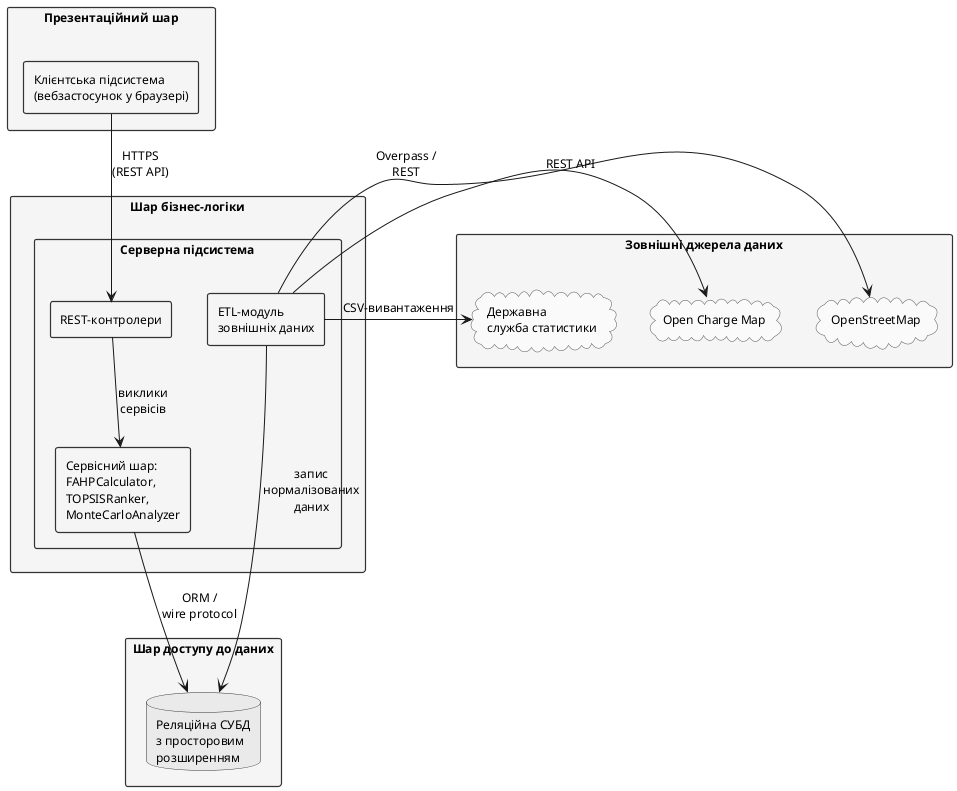

# 2. ПРОЕКТУВАННЯ СИСТЕМИ ДЛЯ ДОСЛІДЖЕННЯ ПРОЦЕСІВ ВИБОРУ ЛОКАЦІЙ ЗАРЯДНИХ СТАНЦІЙ

Постановка завдання, сформульована у підрозділі 1.3, визначає функціональні та нефункціональні вимоги до розроблюваної системи підтримки прийняття рішень, а математичний апарат гібридної обчислювальної схеми, викладений у підрозділах 1.2.4–1.2.6, окреслює обчислювальне ядро системи. Метою цього розділу є переведення зазначених вимог і математичного апарату у проєктні рішення — статичну й динамічну архітектурні моделі системи, інформаційне забезпечення та формалізовані алгоритми функціонування. Виклад дотримується принципу концептуального рівня: проєктування описується у термінах архітектурних стилів, типів сутностей і шарів абстракції, тоді як вибір конкретних інструментальних засобів реалізації подано у Розділі 3.

Розділ структуровано за трьома послідовними рівнями представлення системи. У підрозділі 2.1 наведено статичну й динамічну структуру системи: архітектурну схему, діаграми варіантів використання, класів, послідовності та комунікації, а також специфікацію інтеграційного контракту в стилі REST. У підрозділі 2.2 описано інформаційне забезпечення — концептуальну й логічну моделі бази даних та зовнішні джерела вхідних даних. У підрозділі 2.3 формалізовано алгоритми функціонування системи: обчислювальне ядро Fuzzy AHP, TOPSIS і Монте-Карло у вигляді діаграм активностей і структурного псевдокоду, узагальнюючий сценарій взаємодії компонентів та діаграму розгортання.

## 2.1. Структура системи, що проектується

Підрозділ присвячено проєктуванню статичної й динамічної структури системи. Виклад побудовано від найбільш загального рівня (структурна схема трирівневої архітектури) до операційного рівня — варіантів використання, об'єктної моделі домену, динамічного представлення основного сценарію у часовому й структурному ракурсах та специфікації інтеграційного контракту між клієнтською й серверною підсистемами.

### 2.1.1. Структурна схема системи: елементи та їх взаємодія

Вимоги підрозділу 1.3 — підтримка профілів «Муніципалітет» та «Інвестор», виконання повного циклу Fuzzy AHP–TOPSIS–Монте-Карло за $|A|=12$, $|C|=10$, $N=10\,000$ у межах 5 с, готовність до розширення до 1000+ локацій без перепроєктування ядра — визначають вибір трирівневої клієнт-серверної архітектури з інтеграційним шаром REST API. Структурну схему системи наведено на рис. 2.1.

Рис. 2.1. Структурна схема системи: трирівнева клієнт-серверна архітектура з REST API

**Презентаційний шар** — клієнтська підсистема у браузері (ECMAScript 2022): відображення картографічної основи з реєстром локацій і результатами ранжування; інтерактивне формування нечіткої матриці попарних порівнянь у форматі TFN (підрозділ 1.2.4); візуалізація вектора ваг, ранжування TOPSIS і результатів Монте-Карло-аналізу чутливості. Обчислень гібридної схеми FAHP–TOPSIS–MC цей шар не виконує.

**Шар бізнес-логіки** — серверна підсистема з трьох блоків: REST-контролери (валідація формату й семантики вхідних даних, делегування сервісному шару); сервісний шар (`FAHPCalculator`, `TOPSISRanker`, `MonteCarloAnalyzer`, `OrchestrationService` — оркестрація повного циклу обчислень); ETL-модуль (завантаження даних OSM/OCM/Держстат, нормалізація до WGS-84, запис у сховище).

**Шар доступу до даних** — реляційна СУБД з підтримкою просторових типів (OGC Simple Features, ISO 19125). Зберігає реєстр локацій, словник критеріїв, нечіткі матриці, журнал сеансів і результати ранжування. Просторові атрибути індексовано GiST (субквадратична складність геозапитів).

**Інтеграційні протоколи:** HTTPS REST між клієнтом і сервером (специфікацію ендпоінтів наведено у підрозділі 2.1.6); wire protocol СУБД з ORM-абстракцією між сервером і сховищем; Overpass-запити і REST до зовнішніх сервісів та CSV-вивантаження від Держстату.

Шарова архітектура вибрана за двома ключовими аргументами: принцип єдиної відповідальності (презентаційний шар не містить бізнес-правил, обчислювальне ядро не залежить від конкретного інтерфейсу); незалежне горизонтальне масштабування серверного шару як передумова виконання вимоги готовності до 1000+ локацій без перепроєктування системи (підрозділ 1.3).

Варіанти використання системи і ролі акторів деталізовано у наступному підрозділі.
