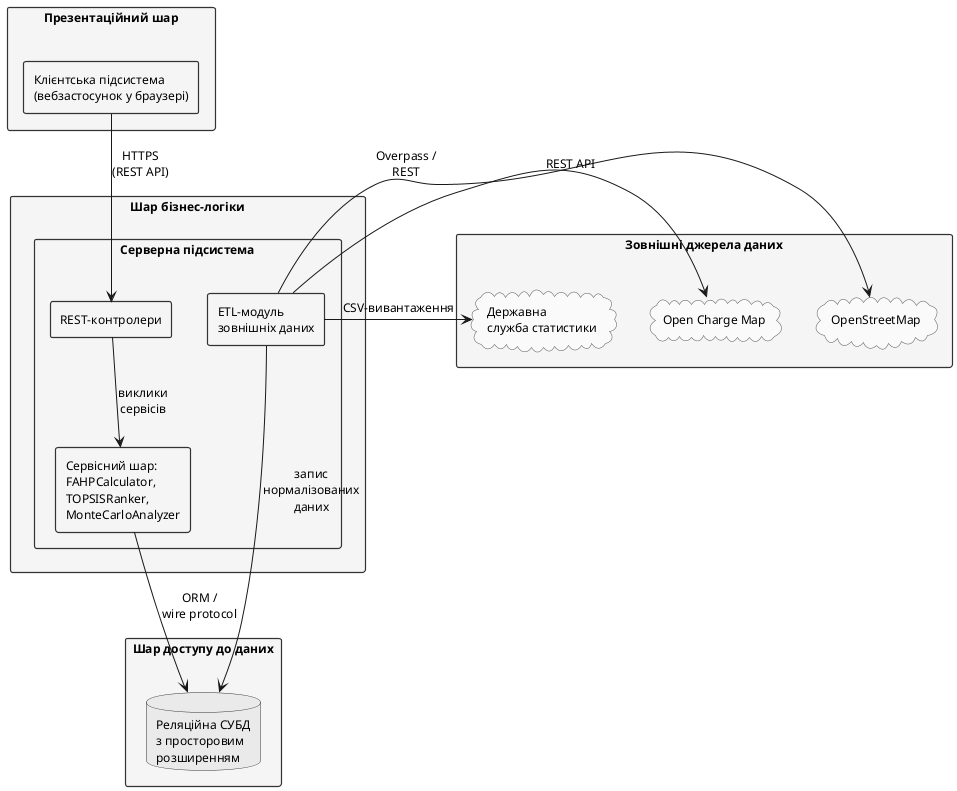

# 2. ПРОЕКТУВАННЯ СИСТЕМИ ДЛЯ ДОСЛІДЖЕННЯ ПРОЦЕСІВ ВИБОРУ ЛОКАЦІЙ ЗАРЯДНИХ СТАНЦІЙ

Метою розділу є переведення вимог підрозділу 1.3 і математичного апарату підрозділів 1.2.4–1.2.6 у проєктні рішення — архітектурну модель системи, інформаційне забезпечення та формалізовані алгоритми функціонування. Виклад ведеться на концептуальному рівні без прив'язки до конкретних інструментальних засобів (вони наведені у Розділі 3). Підрозділ 2.1 описує структуру системи (5 UML-діаграм і REST-специфікація), підрозділ 2.2 — інформаційне забезпечення (ER і логічна модель, зовнішні джерела), підрозділ 2.3 — алгоритми (три псевдокоди, три Activity Diagrams, Deployment Diagram).

## 2.1. Структура системи, що проектується

Підрозділ розкриває статичну й динамічну структуру системи від загального (архітектурна схема) до операційного рівня (алгоритми взаємодії, контракт API).

### 2.1.1. Структурна схема системи: елементи та їх взаємодія

Вимоги підрозділу 1.3 — підтримка профілів «Муніципалітет» та «Інвестор», виконання повного циклу Fuzzy AHP–TOPSIS–Монте-Карло за $|A|=12$, $|C|=10$, $N=10\,000$ у межах 5 с, готовність до розширення до 1000+ локацій без перепроєктування ядра — визначають вибір трирівневої клієнт-серверної архітектури з інтеграційним шаром REST API. Структурну схему системи наведено на рис. 2.1.

Рис. 2.1. Структурна схема системи: трирівнева клієнт-серверна архітектура з REST API

**Презентаційний шар** — клієнтська підсистема у браузері (ECMAScript 2022): відображення картографічної основи з реєстром локацій і результатами ранжування; інтерактивне формування нечіткої матриці попарних порівнянь у форматі TFN (підрозділ 1.2.4); візуалізація вектора ваг, ранжування TOPSIS і результатів Монте-Карло-аналізу чутливості. Обчислень гібридної схеми FAHP–TOPSIS–MC цей шар не виконує.

**Шар бізнес-логіки** — серверна підсистема з трьох блоків: REST-контролери (валідація формату й семантики вхідних даних, делегування сервісному шару); сервісний шар (`FAHPCalculator`, `TOPSISRanker`, `MonteCarloAnalyzer`, `OrchestrationService` — оркестрація повного циклу обчислень); ETL-модуль (завантаження даних OSM/OCM/Держстат, нормалізація до WGS-84, запис у сховище).

**Шар доступу до даних** — реляційна СУБД з підтримкою просторових типів (OGC Simple Features, ISO 19125). Зберігає реєстр локацій, словник критеріїв, нечіткі матриці, журнал сеансів і результати ранжування. Просторові атрибути індексовано GiST (субквадратична складність геозапитів).

**Інтеграційні протоколи:** HTTPS REST між клієнтом і сервером (специфікацію ендпоінтів наведено у підрозділі 2.1.6); wire protocol СУБД з ORM-абстракцією між сервером і сховищем; Overpass-запити і REST до зовнішніх сервісів та CSV-вивантаження від Держстату.

Шарова архітектура вибрана за двома ключовими аргументами: принцип єдиної відповідальності (презентаційний шар не містить бізнес-правил, обчислювальне ядро не залежить від конкретного інтерфейсу); незалежне горизонтальне масштабування серверного шару як передумова виконання вимоги готовності до 1000+ локацій без перепроєктування системи (підрозділ 1.3).

Варіанти використання системи і ролі акторів деталізовано у наступному підрозділі.
