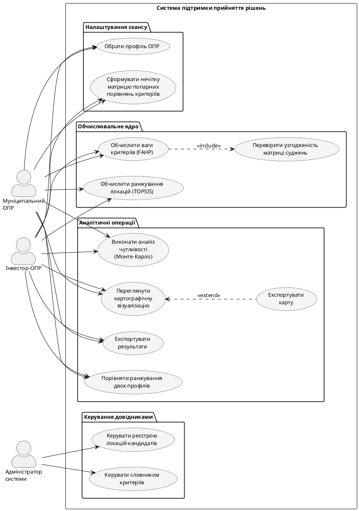

### 2.1.2. Діаграма варіантів використання

У предметній галузі виокремлено три актори. **Муніципальний ОПР** — представник міської адміністрації; пріоритет соціальних критеріїв (рівномірність територіального покриття, щільність населення, екологічна доцільність). **Інвестор-ОПР** — приватний суб'єкт; пріоритет економічних критеріїв (інтенсивність транспортних потоків, супутня комерційна інфраструктура, рентабельність). **Адміністратор системи** — ведення реєстру локацій-кандидатів і словника критеріїв; обґрунтування дворівневої схеми ОПР — у підрозділі 1.1.5.

Виокремлено десять варіантів використання у чотирьох групах: «Налаштування сеансу» (вибір профілю, формування матриці $\tilde{A}$), «Обчислювальне ядро» (Fuzzy AHP, TOPSIS), «Аналітичні операції» (картографічна візуалізація, аналіз чутливості МК, порівняння профілів, експорт), «Керування довідниками» (реєстр локацій, словник критеріїв). Діаграму варіантів використання наведено на рис. 2.2.

![Діаграма варіантів використання системи. Три актори (Муніципальний ОПР, Інвестор-ОПР, Адміністратор системи) розташовано ліворуч; контур системи містить дванадцять варіантів використання, згрупованих у чотири тематичні групи. Муніципальний і Інвестор-ОПР асоційовано з усіма аналітичними варіантами використання, окрім керування довідниками. Адміністратор системи асоційовано лише з варіантами керування реєстром локацій і словником критеріїв. Зв'язки include і extend відображають включення перевірки узгодженості у процедуру обчислення ваг та опціональне розширення картографічного перегляду експортом карти](images/fig_2_2_use_case_diagram.png)

Рис. 2.2. Діаграма варіантів використання системи

Відношення `<<include>>` від «Обчислити ваги критеріїв (FAHP)» до «Перевірити узгодженість матриці суджень» відображає обов'язковий контроль $CR \leq 0{,}1$ як умову коректності вхідних суджень: якщо контроль не пройдено, виклик «Обчислити ранжування локацій (TOPSIS)» блокується через відсутність валідного вектора ваг. Відношення `<<extend>>` від «Переглянути картографічну візуалізацію» до «Експортувати карту» відображає опціональну дію, що виконується на явний запит ОПР.

Об'єктна модель домену, що реалізує описані варіанти використання на рівні класів, наведена у наступному підрозділі.
