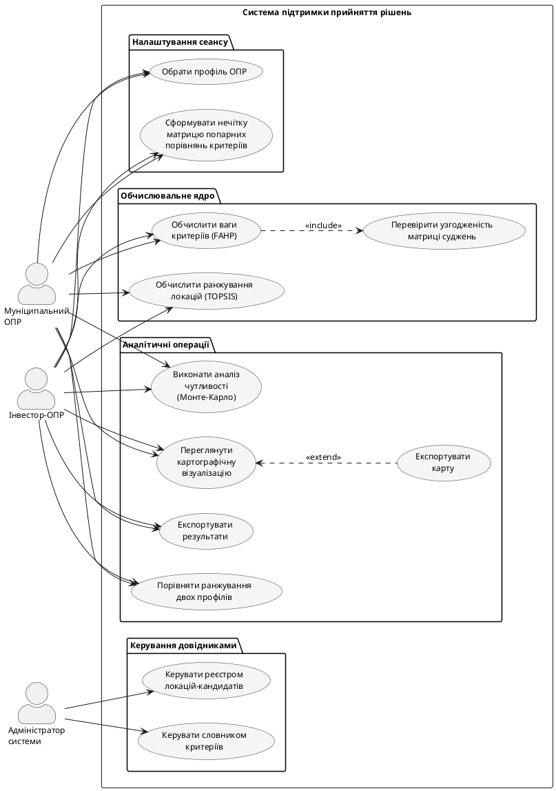

### 2.1.2. Діаграма варіантів використання

Виокремлено три актори: **Муніципальний ОПР** (пріоритет соціальних критеріїв), **Інвестор-ОПР** (пріоритет економічних критеріїв), **Адміністратор системи** (ведення реєстру локацій і словника критеріїв; обґрунтування дворівневої схеми ОПР – у підрозділі 1.1.5). Десять варіантів використання згруповано у чотири блоки: «Налаштування сеансу», «Обчислювальне ядро», «Аналітичні операції», «Керування довідниками». Діаграму наведено на рис. 2.2.

Рис. 2.2. Діаграма варіантів використання системи

Відношення `<<include>>` (FAHP → перевірка узгодженості) фіксує обов'язковість контролю $CR \leq 0{,}1$: за невиконання виклик TOPSIS блокується через відсутність валідного вектора ваг. Відношення `<<extend>>` (картографічна візуалізація → експорт карти) відображає опціональну дію на запит ОПР.
