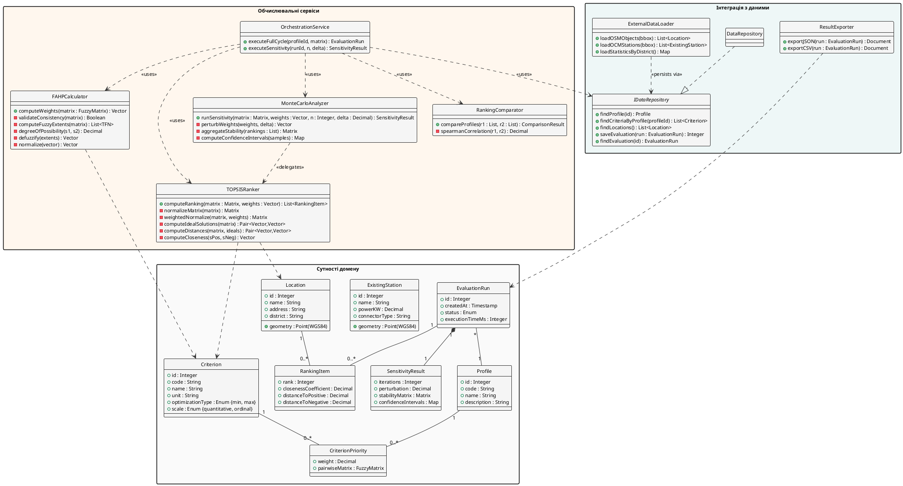

### 2.1.3. Діаграма класів

Класи поділено на три кластери: **сутності домену** (постійні бізнес-об'єкти), **обчислювальні сервіси** (гібридне ядро FAHP–TOPSIS–МК) та **інтеграція з даними** (доступ до сховища і зовнішніх джерел). Імена класів не містять назв фреймворків; реалізаційні рішення – у 3.1.2 і 3.1.4. Діаграму наведено на рис. 2.3.

![Діаграма класів системи. У центрі – EvaluationRun, агрегатор обчислювального сеансу, з композицією до SensitivityResult та асоціацією M:1 з Profile. Profile зв'язано M:N з Criterion через клас-зв'язок CriterionPriority. Location з просторовим атрибутом geometry зв'язаний M:N з EvaluationRun через RankingItem (rank, closenessCoefficient, distanceToPositive, distanceToNegative). Обчислювальні сервіси FAHPCalculator, TOPSISRanker, MonteCarloAnalyzer, RankingComparator з ключовими методами та залежностями до сутностей домену. OrchestrationService оркеструє виклики сервісів. Інтерфейс IDataRepository реалізовано DataRepository; ExternalDataLoader – зовнішні джерела даних](images/fig_2_3_class_diagram.png)

Рис. 2.3. Діаграма класів системи

Сутності домену (8 класів) – `Profile`, `Criterion`, `CriterionPriority` (клас-зв'язок з нечіткою матрицею $\tilde{A} = [\tilde{a}_{ij}]$, $\tilde{a}_{ij} = (l_{ij}, m_{ij}, u_{ij})$), `Location` (геометрія WGS-84), `ExistingStation`, `EvaluationRun`, `RankingItem` ($C_i^*$, $S_i^+$, $S_i^-$), `SensitivityResult` ($N$, $\delta$, матриця $p_i(k)$, довірчі інтервали).

Обчислювальні сервіси (5 класів): `FAHPCalculator` за (1.3)–(1.9); `TOPSISRanker` за (1.10)–(1.14); `MonteCarloAnalyzer` за (1.15)–(1.17) з делегуванням TOPSIS у циклі $N = 10\,000$; `RankingComparator` (кореляція Спірмена); `OrchestrationService` (фасад).

Інтеграція з даними (4 класи): `IDataRepository` (інтерфейс), `DataRepository` (реалізація), `ExternalDataLoader` (OSM/OCM/Держстат), `ResultExporter` (JSON/CSV).

Ключові відношення: асоціація «профіль–критерій» через `CriterionPriority` зберігає TFN-елементи; композиція `EvaluationRun ◇–– SensitivityResult`; залежність `MonteCarloAnalyzer → TOPSISRanker` фіксує повторне використання TOPSIS у кожній ітерації МК.
