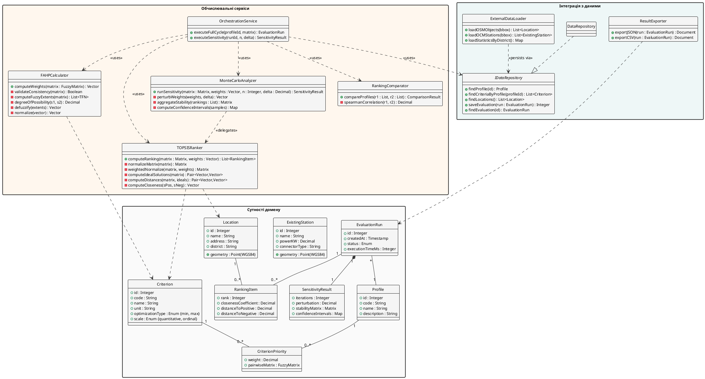

### 2.1.3. Діаграма класів

Класи системи поділено на три кластери. **Кластер сутностей домену** описує постійні бізнес-об'єкти. **Кластер обчислювальних сервісів** реалізує гібридне обчислювальне ядро FAHP–TOPSIS–МК. **Кластер інтеграції з даними** інкапсулює доступ до сховища і зовнішніх джерел. Імена класів не містять назв конкретних фреймворків; реалізаційні рішення наведено у підрозділах 3.1.2 та 3.1.4. Діаграму класів наведено на рис. 2.3.

![Діаграма класів системи. У центрі діаграми — клас EvaluationRun, що відіграє роль агрегатора обчислювального сеансу, з композиційним зв'язком до SensitivityResult та асоціацією багатьох до одного з Profile. Профіль зв'язано асоціацією багато-до-багатьох з Criterion через клас-зв'язок CriterionPriority, що зберігає ваги критеріїв за профілями. Клас Location містить просторовий атрибут geometry і пов'язаний асоціацією багато-до-багатьох з EvaluationRun через клас RankingItem (атрибути rank, closenessCoefficient, distanceToPositive, distanceToNegative). Обчислювальні сервіси FAHPCalculator, TOPSISRanker, MonteCarloAnalyzer і RankingComparator зображено з ключовими методами; вони пов'язані залежностями з відповідними сутностями домену. Клас OrchestrationService показує оркестрацію викликів сервісів. Інтерфейс IDataRepository реалізовано класом DataRepository з методами доступу до постійного сховища, а ExternalDataLoader забезпечує комунікацію із зовнішніми джерелами даних](images/fig_2_3_class_diagram.png)

Рис. 2.3. Діаграма класів системи

Сутності домену (8 класів): `Profile` — профіль ОПР (`municipal`/`investor`); `Criterion` — критерій оцінювання з типом оптимізації і шкалою; `CriterionPriority` — клас-зв'язок профіль–критерій з нечіткою матрицею $\tilde{A} = [\tilde{a}_{ij}]$, де $\tilde{a}_{ij} = (l_{ij}, m_{ij}, u_{ij})$ за шкалою Саати; `Location` — локація-кандидат з геометрією у WGS-84; `ExistingStation` — наявна зарядна станція (потужність, тип конектора, геометрія); `EvaluationRun` — обчислювальний сеанс (статус, час виконання); `RankingItem` — елемент ранжування (ранг, $C_i^*$, $S_i^+$, $S_i^-$); `SensitivityResult` — результат Монте-Карло ($N$, $\delta$, матриця $p_i(k)$, довірчі інтервали).

Обчислювальні сервіси (5 класів): `FAHPCalculator` — обчислює вектор ваг за формулами (1.3)–(1.9); `TOPSISRanker` — обчислює ранжування за формулами (1.10)–(1.14); `MonteCarloAnalyzer` — аналіз чутливості за формулами (1.15)–(1.17), делегує `TOPSISRanker` у внутрішньому циклі $N = 10\,000$ ітерацій; `RankingComparator` — рангова кореляція Спірмена між двома профілями; `OrchestrationService` — фасад, що оркеструє послідовний виклик сервісів і збереження результатів.

Інтеграція з даними (4 класи): `IDataRepository` — інтерфейс доступу до сховища; `DataRepository` — реалізація; `ExternalDataLoader` — завантаження OSM/OCM/Держстат; `ResultExporter` — генерація JSON/CSV звітів.

Ключові відношення: асоціація «профіль–критерій» через `CriterionPriority` зберігає TFN-елементи матриці суджень; композиція `EvaluationRun ◇—— SensitivityResult` (результат чутливості не існує поза сеансом); залежність «делегує» `MonteCarloAnalyzer → TOPSISRanker` підкреслює повторне використання TOPSIS у кожній ітерації МК.

Динамічну модель — взаємодію між класами у часі — наведено у наступному підрозділі.
