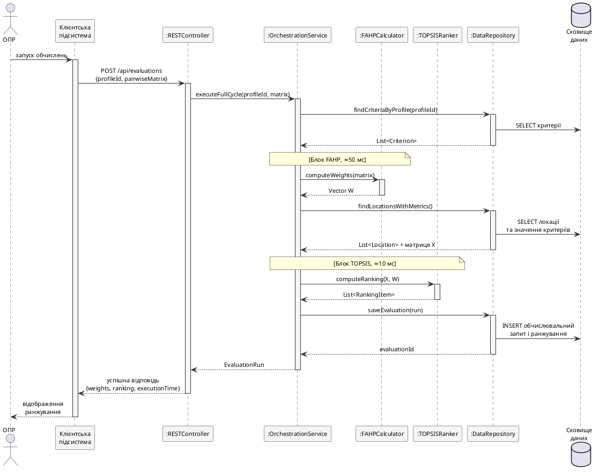

### 2.1.4. Діаграма послідовності основного сценарію

Основним сценарієм для динамічного моделювання обрано «Обчислити ранжування локацій-кандидатів» — він активує найбільшу кількість компонентів і покриває повний цикл «запит — оркестрація обчислень — результат». У сценарії беруть участь сім учасників: ОПР (зовнішній актор), `Client` (клієнтська підсистема), `RESTController`, `OrchestrationService`, `FAHPCalculator`, `TOPSISRanker`, `DataRepository`. Сценарій складається з трьох фаз: підготовка вхідних даних, обчислювальне ядро (FAHP→TOPSIS) і фіксація результату. Діаграму послідовності наведено на рис. 2.4.

![Діаграма послідовності для сценарію «Обчислити ранжування локацій». Сім ліній життя (ОПР, Client, RESTController, OrchestrationService, FAHPCalculator, TOPSISRanker, DataRepository) і лінія сховища. Послідовність повідомлень: користувач ініціює обчислення на клієнті, клієнт надсилає REST-запит на створення обчислювального ресурсу, REST-контролер делегує OrchestrationService, який послідовно звертається до DataRepository за критеріями, викликає FAHPCalculator для обчислення ваг, отримує матрицю рішень з DataRepository, викликає TOPSISRanker для ранжування, зберігає обчислювальний запит і його результати, повертає об'єкт EvaluationRun REST-контролеру, який повертає HTTP-відповідь клієнту, той відображає ранжування користувачеві. Часові маркери: блок FAHP ~50 мс, блок TOPSIS ~10 мс](images/fig_2_4_sequence_diagram.png)

Рис. 2.4. Діаграма послідовності сценарію «Обчислити ранжування локацій»

Фаза 1 — підготовка вхідних даних: `Client` надсилає `POST /api/evaluations` із тілом `{profileId, pairwiseMatrix}`, що містить нечітку матрицю $\tilde{A}$ у вигляді трійок $(l_{ij}, m_{ij}, u_{ij})$; `RESTController` виконує валідацію формату й узгодженість матриці з реєстром критеріїв, після чого делегує `OrchestrationService`. Фаза 2 — обчислювальне ядро: `OrchestrationService` послідовно викликає `FAHPCalculator.computeWeights` (~50 мс) і `TOPSISRanker.computeRanking` (~10 мс); сумарна тривалість 60–80 мс залишає запас від нефункціональної вимоги «5 с на повний цикл, включно з $N = 10\,000$ ітераціями Монте-Карло» (підрозділ 1.3). Фаза 3 — фіксація результату: `OrchestrationService` зберігає `EvaluationRun` і список `RankingItem` через `DataRepository` (INSERT у `evaluation_runs` і `ranking_items`), після чого `RESTController` повертає JSON-відповідь із вектором ваг, ранжуванням і часом виконання.

Альтернативне представлення тієї самої взаємодії з акцентом на структурі зв'язків між учасниками, а не на часовій послідовності, наведено у наступному підрозділі.
