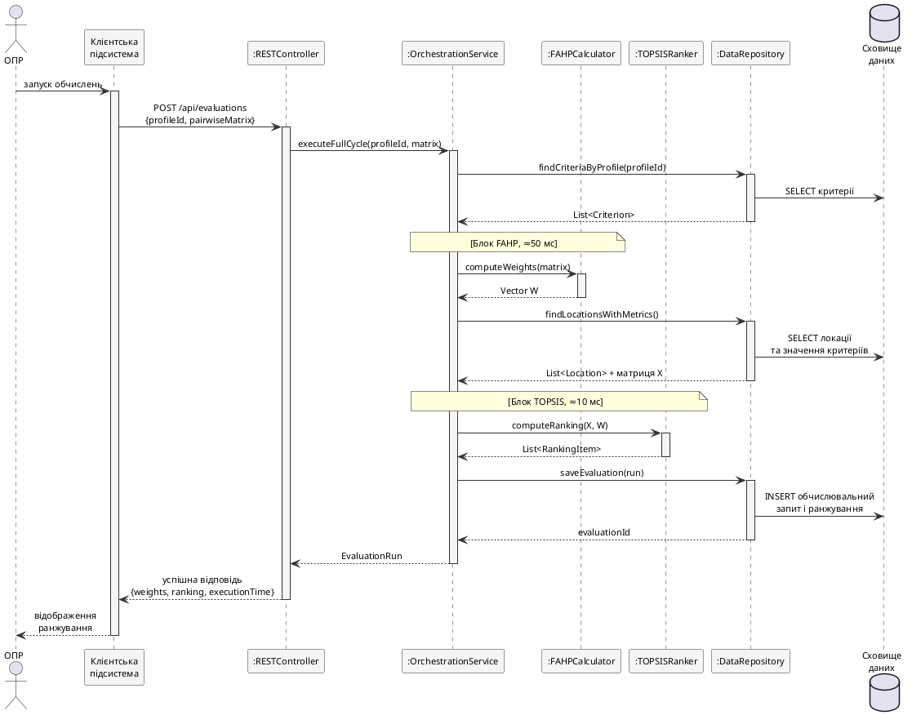

### 2.1.4. Діаграма послідовності основного сценарію

Основним для динамічного моделювання обрано сценарій «Обчислити ранжування локацій-кандидатів» – він активує максимум компонентів і покриває повний цикл. Учасники: ОПР, `Client`, `RESTController`, `OrchestrationService`, `FAHPCalculator`, `TOPSISRanker`, `DataRepository`. Сценарій – три фази: підготовка даних, обчислювальне ядро (FAHP→TOPSIS), фіксація результату (рис. 2.4).

![Діаграма послідовності для сценарію «Обчислити ранжування локацій». Сім ліній життя (ОПР, Client, RESTController, OrchestrationService, FAHPCalculator, TOPSISRanker, DataRepository) і сховище. Послідовність: користувач ініціює обчислення, клієнт надсилає REST-запит, контролер делегує OrchestrationService, який звертається до DataRepository за критеріями, викликає FAHPCalculator (ваги), отримує матрицю рішень, викликає TOPSISRanker (ранжування), зберігає EvaluationRun і RankingItem, повертає об'єкт контролеру, той – HTTP-відповідь клієнту, який відображає ранжування. Часи: FAHP ~50 мс, TOPSIS ~10 мс](images/fig_2_4_sequence_diagram.png)

Рис. 2.4. Діаграма послідовності сценарію «Обчислити ранжування локацій»

Фаза 1 – підготовка даних: `Client` надсилає `POST /api/evaluations` з тілом `{profileId, pairwiseMatrix}`, що містить $\tilde{A}$ у вигляді трійок $(l_{ij}, m_{ij}, u_{ij})$; `RESTController` валідує формат і узгодженість з реєстром критеріїв та делегує `OrchestrationService`. Фаза 2 – ядро: послідовний виклик `FAHPCalculator.computeWeights` (~50 мс) і `TOPSISRanker.computeRanking` (~10 мс); сумарно 60–80 мс із запасом від вимоги 5 с (підрозділ 1.3). Фаза 3 – фіксація: збереження `EvaluationRun` і `RankingItem` через `DataRepository`, відповідь з вектором ваг, ранжуванням і часом виконання.
