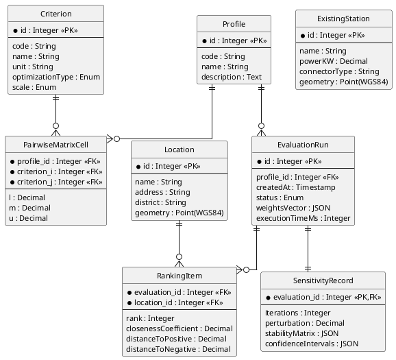

## 2.2. Опис інформаційного забезпечення

Підрозділ присвячено проєктуванню інформаційного забезпечення системи від концептуального рівня (ER-модель) через логічний рівень (реляційна схема) до опису потоків зовнішніх вхідних даних. Тип СУБД на цьому етапі описується узагальнено як «реляційна СУБД з підтримкою просторових типів і операцій згідно зі стандартом OGC Simple Features» — вибір конкретного засобу обговорено у підрозділі 3.1.4.

### 2.2.1. Концептуальна модель даних

У моделі виокремлено вісім сутностей. **Profile** — профіль ОПР (код `municipal` або `investor`, найменування, опис). **Criterion** — критерій оцінювання (код, найменування, одиниця виміру, тип оптимізації, шкала); структура відповідає Табл. 1.10. **PairwiseMatrixCell** — асоціативна сутність зв'язку «профіль–критерій»: зберігає одне нечітке судження $\tilde{a}_{ij}$ у вигляді трійки $(l, m, u)$ — нижньої межі, модального значення і верхньої межі TFN (підрозділ 1.2.4). **Location** — локація-кандидат (найменування, поштова адреса, адміністративний район м. Київ, геометрія у WGS-84); відповідає Табл. 1.9. **ExistingStation** — наявна зарядна станція (потужність, тип конектора, геометрія); довідникова сутність для критеріїв конкурентної насиченості. **EvaluationRun** — обчислювальний сеанс (профіль, момент створення, статус, вектор ваг, тривалість). **RankingItem** — елемент ранжування: пара `(EvaluationRun, Location)` з рангом, $C_i^*$, $S_i^+$, $S_i^-$. **SensitivityRecord** — результат Монте-Карло-аналізу: матриця $p_i(k)$, довірчі інтервали, параметри $N$ і $\delta$. Концептуальну модель даних наведено на рис. 2.6.

![Концептуальна (ER) модель даних системи у нотації Чена з елементами crow's foot. Вісім сутностей (Profile, Criterion, PairwiseMatrixCell, Location, ExistingStation, EvaluationRun, RankingItem, SensitivityRecord) з відповідними атрибутами і ключовими полями. Відношення: Profile та Criterion зв'язані багато-до-багатьох через PairwiseMatrixCell; Profile до EvaluationRun — один-до-багатьох; EvaluationRun до RankingItem — один-до-багатьох; EvaluationRun до SensitivityRecord — один-до-одного з композицією; Location до RankingItem — один-до-багатьох; ExistingStation — самостійна сутність-довідник без прямих зв'язків з обчислювальним циклом](images/fig_2_6_er_diagram.png)

Рис. 2.6. Концептуальна (ER) модель даних системи

Ключові відношення з кардинальностями: `Profile` ↔ `Criterion` — M:N через `PairwiseMatrixCell` (різні профілі мають різні матриці суджень для тих самих критеріїв); `Profile` → `EvaluationRun` — 1:N (один профіль — кілька сеансів з різними варіантами матриці); `EvaluationRun` ◇—— `SensitivityRecord` — 1:1 композиція (запис чутливості не існує поза своїм сеансом); `Location` → `RankingItem` — 1:N (локація з'являється у ранжуванні кожного сеансу).

Логічну реляційну схему з ключами, обмеженнями цілісності і просторовою індексацією наведено у наступному підрозділі.
