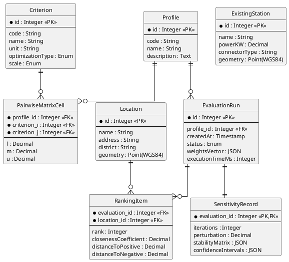

## 2.2. Опис інформаційного забезпечення

Підрозділ описує інформаційне забезпечення від концептуального рівня (ER) через логічний (реляційна схема) до зовнішніх потоків даних. СУБД описано узагальнено як «реляційна СУБД з просторовими типами OGC Simple Features» – вибір конкретного засобу – у 3.1.4.

### 2.2.1. Концептуальна модель даних

Виокремлено вісім сутностей: **Profile** (код `municipal`/`investor`); **Criterion** (структура за Табл. 1.10); **PairwiseMatrixCell** – асоціативна сутність «профіль–критерій», зберігає $\tilde{a}_{ij} = (l, m, u)$ (підрозділ 1.2.4); **Location** (Табл. 1.9, геометрія WGS-84); **ExistingStation** (довідник для критеріїв насиченості); **EvaluationRun** (профіль, час, статус, вектор ваг, тривалість); **RankingItem** (пара `(EvaluationRun, Location)` з $C_i^*$, $S_i^+$, $S_i^-$); **SensitivityRecord** ($p_i(k)$, довірчі інтервали, $N$, $\delta$). Концептуальну модель наведено на рис. 2.6.

Рис. 2.6. Концептуальна (ER) модель даних системи

Ключові відношення: `Profile` ↔ `Criterion` – M:N через `PairwiseMatrixCell`; `Profile` → `EvaluationRun` – 1:N; `EvaluationRun` ◇–– `SensitivityRecord` – 1:1 композиція; `Location` → `RankingItem` – 1:N.
