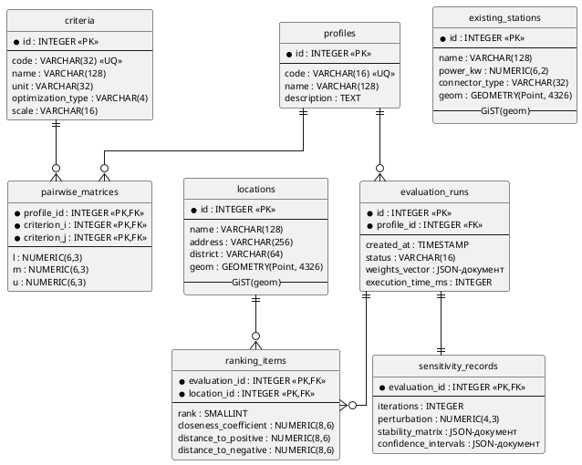

### 2.2.2. Логічна модель бази даних і атрибути таблиць

Концептуальна модель (2.2.1) відображається у реляційну схему у 3НФ з восьми таблиць. Цілісність забезпечують первинні і зовнішні ключі з каскадним видаленням для композиційних зв'язків (`ON DELETE CASCADE` для `sensitivity_records → evaluation_runs`) та обмеження `CHECK` на інваріантах алгоритмів ($CR \leq 0{,}1$, $C_i^* \in [0, 1]$, $S_i^{\pm} \geq 0$, $rank \geq 1$). Просторові атрибути `locations` і `existing_stations` мають тип `GEOMETRY(Point, 4326)`; GiST-індекси знижують складність геозапитів до $O(\log n)$ – передумова масштабованості до 1000+ локацій (1.3). Перелік таблиць наведено у Табл. 2.2.

Таблиця 2.2 – Логічна схема таблиць бази даних

| Таблиця | Призначення | Ключові поля | Індекси |
|---|---|---|---|
| `profiles` | Довідник профілів ОПР | PK: `id`; UNIQUE: `code` | B-tree на `code` |
| `criteria` | Словник критеріїв оцінювання | PK: `id`; UNIQUE: `code` | B-tree на `code` |
| `pairwise_matrices` | Нечіткі судження за профілями | PK: (`profile_id`, `criterion_i`, `criterion_j`); FK: `profile_id`, `criterion_i`, `criterion_j` | B-tree на `profile_id` |
| `locations` | Реєстр локацій-кандидатів | PK: `id` | GiST на `geom`; B-tree на `district` |
| `existing_stations` | Довідник наявних зарядних станцій | PK: `id` | GiST на `geom` |
| `evaluation_runs` | Журнал обчислювальних сеансів | PK: `id`; FK: `profile_id` | B-tree на `profile_id`, `created_at` |
| `ranking_items` | Елементи результуючого ранжування | PK: (`evaluation_id`, `location_id`); FK: `evaluation_id`, `location_id` | B-tree на `evaluation_id` |
| `sensitivity_records` | Результати аналізу чутливості | PK і FK: `evaluation_id` (ON DELETE CASCADE) | – |

Логічну схему БД з ключами та індексами наведено на рис. 2.7.

Рис. 2.7. Логічна схема бази даних

Атрибути `weights_vector`, `stability_matrix`, `confidence_intervals` реалізовано семіструктурованими документами замість нормалізованих таблиць – це забезпечує атомарне отримання повного результату одним SELECT-запитом. Вектор ваг $W$ і матриця $p_i(k)$ завжди передаються як неподільне ціле. Повний опис атрибутів – у Додатку Г.
