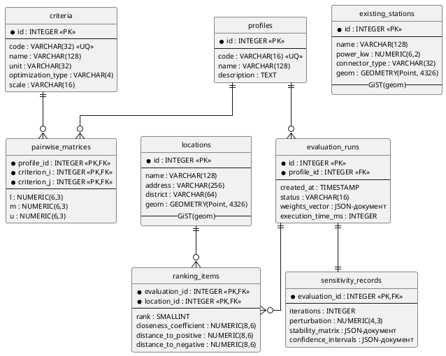

### 2.2.2. Логічна модель бази даних і атрибути таблиць

Концептуальна модель, наведена у підрозділі 2.2.1, відображається у реляційну схему у третій нормальній формі з восьми таблиць. Цілісність даних забезпечується первинними ключами, зовнішніми ключами з каскадним видаленням для композиційних зв'язків (`ON DELETE CASCADE` для `sensitivity_records → evaluation_runs`) та обмеженнями `CHECK` на інваріантах алгоритмів: $CR \leq 0{,}1$, $C_i^* \in [0, 1]$, $S_i^{\pm} \geq 0$, $rank \geq 1$. Просторові атрибути таблиць `locations` і `existing_stations` реалізовано типом `GEOMETRY(Point, 4326)` (WGS-84); на цих колонках створено GiST-індекси, що знижують складність геозапитів до $O(\log n)$ і є необхідною передумовою архітектурної готовності системи до розширення до 1000+ локацій (підрозділ 1.3). Перелік таблиць, їхнього призначення та індексів наведено у Табл. 2.2.

Таблиця 2.2. — Логічна схема таблиць бази даних

| Таблиця | Призначення | Ключові поля | Індекси |
|---|---|---|---|
| `profiles` | Довідник профілів ОПР | PK: `id`; UNIQUE: `code` | B-tree на `code` |
| `criteria` | Словник критеріїв оцінювання | PK: `id`; UNIQUE: `code` | B-tree на `code` |
| `pairwise_matrices` | Нечіткі судження за профілями | PK: (`profile_id`, `criterion_i`, `criterion_j`); FK: `profile_id`, `criterion_i`, `criterion_j` | B-tree на `profile_id` |
| `locations` | Реєстр локацій-кандидатів | PK: `id` | GiST на `geom`; B-tree на `district` |
| `existing_stations` | Довідник наявних зарядних станцій | PK: `id` | GiST на `geom` |
| `evaluation_runs` | Журнал обчислювальних сеансів | PK: `id`; FK: `profile_id` | B-tree на `profile_id`, `created_at` |
| `ranking_items` | Елементи результуючого ранжування | PK: (`evaluation_id`, `location_id`); FK: `evaluation_id`, `location_id` | B-tree на `evaluation_id` |
| `sensitivity_records` | Результати аналізу чутливості | PK і FK: `evaluation_id` (ON DELETE CASCADE) | — |

Логічну схему БД з первинними та зовнішніми ключами і просторовими індексами наведено на рис. 2.7.

![Логічна схема бази даних: вісім таблиць з первинними і зовнішніми ключами. Таблиці profiles і criteria — довідники з первинними ключами на полі id. Таблиця pairwise_matrices з композитним первинним ключем (profile_id, criterion_i, criterion_j) і трьома зовнішніми ключами. Таблиця locations містить просторову колонку geom типу GEOMETRY(Point, 4326) з GiST-індексом. Таблиця existing_stations містить аналогічну просторову колонку з GiST-індексом. Таблиця evaluation_runs з зовнішнім ключем profile_id і JSON-полем weights_vector для збереження обчисленого вектора ваг. Таблиця ranking_items з композитним первинним ключем (evaluation_id, location_id). Таблиця sensitivity_records з первинним ключем evaluation_id, що одночасно є зовнішнім ключем з каскадним видаленням](images/fig_2_7_logical_schema.png)

Рис. 2.7. Логічна схема бази даних

Атрибути `weights_vector` (`evaluation_runs`) та `stability_matrix`, `confidence_intervals` (`sensitivity_records`) реалізовано семіструктурованими JSON-документами замість нормалізованих таблиць. Це забезпечує атомарне отримання повного результату одним SELECT-запитом без багатотабличного з'єднання — оптимальне рішення для типового сценарію відображення результатів сеансу клієнтській підсистемі. Вектор ваг $W$ як результат FAHP та матриця стабільності $p_i(k)$ завжди передаються як неподільне ціле.

Повний опис атрибутів усіх восьми таблиць наведено у Додатку Г.

Запропонована логічна схема забезпечує повне покриття інформаційного забезпечення системи; потоки вхідних даних від зовнішніх джерел описано у наступному підрозділі.
