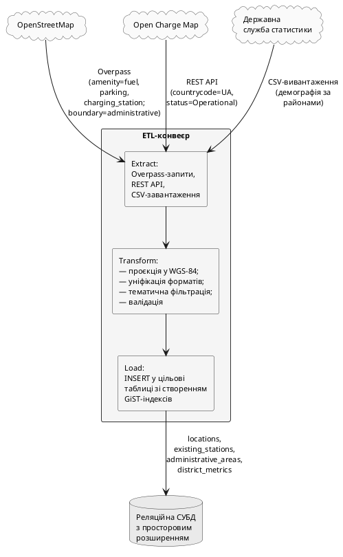

### 2.2.3. Зовнішні джерела даних

Сховище системи наповнюється з трьох зовнішніх джерел. **OpenStreetMap** — відкритий геоінформаційний проєкт: надає просторові дані про інфраструктурні об'єкти (класи `amenity=fuel`, `amenity=parking`, `amenity=charging_station`) та адміністративні межі м. Київ (`boundary=administrative` рівня району); доступ — через Overpass-запити. **Open Charge Map** — краудсорсингова база зарядних станцій: координати, тип конектора, номінальна потужність, оператор, статус; доступ — REST API з фільтром `countrycode=UA` і статусом «активна». **Державна служба статистики України** — офіційна статистика за адміністративними районами (щільність населення, середній дохід домогосподарства, кількість зареєстрованих транспортних засобів); доступ — CSV-вивантаження з порталу відкритих даних.

Потік даних реалізується ETL-конвеєром з трьох фаз: **Extract** — звернення до джерел за відповідними протоколами; **Transform** — приведення координат до WGS-84 (EPSG:4326), уніфікація форматів, тематична фільтрація (для OCM — лише активні станції; для OSM — лише теги із зазначених класів), валідація; **Load** — INSERT у цільові таблиці зі створенням GiST-індексів на колонках `geom`. Перелік джерел, типів даних, цільових таблиць і частоти актуалізації наведено у Табл. 2.4.

![Концептуальний потік даних: три зовнішні джерела (OpenStreetMap, Open Charge Map, Державна служба статистики) подають інформацію в ETL-конвеєр, що містить три послідовні фази — витяг (Extract) з відповідними протоколами, трансформація (Transform) з нормалізацією і фільтрацією, завантаження (Load) у реляційну СУБД зі створенням просторових індексів GiST. Стрілки від джерел підписано протоколами і типами об'єктів: OSM — Overpass-запити з тегами amenity і boundary; OCM — REST API з фільтром країни; Держстат — CSV-вивантаження. Стрілка з фази Load до сховища підписана переліком цільових таблиць](images/fig_2_8_external_data_flow.png)

Рис. 2.8. Концептуальний потік даних: зовнішні джерела → ETL-конвеєр → постійне сховище

Таблиця 2.4. — Зовнішні джерела даних, типи об'єктів та цільові таблиці сховища

| Джерело | Тип даних | Об'єкти / класи / показники | Цільова таблиця | Частота актуалізації |
|---|---|---|---|---|
| OpenStreetMap | Просторові, тегувальні | `amenity=fuel`, `amenity=parking`, `amenity=charging_station`, `power=substation` | `locations`, `osm_pois` | Щомісяця |
| OpenStreetMap | Просторові, адміністративні | `boundary=administrative` рівня району | `administrative_areas` | Щомісяця |
| Open Charge Map | Атрибутивні, просторові | Координати, потужність, тип конектора, оператор, статус ЗС | `existing_stations` | Щотижня |
| Державна служба статистики України | Статистичні | Щільність населення, середній дохід, кількість зареєстрованих авто за районами | `district_metrics` | Щоквартально |

Достовірність вхідних даних забезпечується трьома заходами. На фазі трансформації ETL відкидаються точки поза межами Києва та з відсутніми обов'язковими атрибутами. Наявні станції OCM звіряються з OSM просторовим з'єднанням у радіусі 50 м: за відсутності збігу точка позначається та виноситься у звіт для верифікації адміністратором. Адміністратор має можливість ручного коригування реєстру через ендпоінти з підрозділу 2.1.6.

У наступному підрозділі формалізовано алгоритми функціонування — обчислювальне ядро FAHP–TOPSIS–МК та модель розгортання системи.
