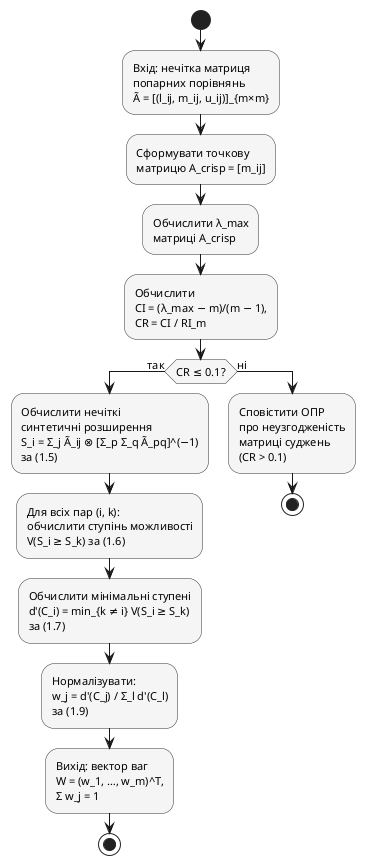

## 2.3. Розробка алгоритмів функціонування системи

У підрозділі формалізовано алгоритми, що реалізують обчислювальне ядро системи. Кожен з трьох методів гібридної схеми, математичний апарат яких викладено у підрозділах 1.2.4–1.2.6, поданий у двох взаємодоповнювальних формах: UML Activity Diagram і структурний псевдокод. Завершують підрозділ діаграма активностей загального сценарію зі swimlane-доріжками та діаграма розгортання на концептуальному рівні.

### 2.3.1. Алгоритм Fuzzy AHP

Алгоритм реалізує формули (1.3)–(1.9) підрозділу 1.2.4. Вхід: нечітка матриця попарних порівнянь $\tilde{A} = [(l_{ij}, m_{ij}, u_{ij})]_{m \times m}$. Вихід: нормалізований вектор ваг $W = (w_1, \ldots, w_m)^T$ із $\sum_{j=1}^{m} w_j = 1$. Алгоритм виконується у сім кроків:

1. Формування точкової матриці $A_{\text{crisp}} = [m_{ij}]$ з модальних значень TFN.
2. Обчислення $\lambda_{\max}$ матриці $A_{\text{crisp}}$ методом степеневих ітерацій.
3. Обчислення $CI = (\lambda_{\max} - m)/(m - 1)$ та $CR = CI / RI_m$ (таблиця Сааті).
4. Контроль узгодженості: якщо $CR > 0{,}1$ — завершення з повідомленням ОПР; якщо $CR \leq 0{,}1$ — продовження.
5. Обчислення нечітких синтетичних розширень $S_i$ за формулою (1.5).
6. Обчислення ступенів можливості $V(S_i \geq S_k)$ за (1.6) і мінімальних ступенів $d'(C_i)$ за (1.7).
7. Нормалізація $w_j = d'(C_j) / \sum_{l} d'(C_l)$ за формулою (1.9).

Графічне подання алгоритму у нотації UML Activity Diagram наведено на рис. 2.9.

![Діаграма активностей алгоритму Fuzzy AHP. Початковий вузол — вхід нечіткої матриці попарних порівнянь. Послідовно виконуються активності: формування точкової матриці модальних значень, обчислення λ_max, обчислення CI та CR. Гілка рішення CR ≤ 0.1 розділяє потік на дві гілки. Гілка «ні» завершується вузлом повідомлення ОПР про неузгодженість і кінцевим вузлом. Гілка «так» продовжується активностями обчислення нечітких синтетичних розширень за формулою (1.5), обчислення ступенів можливості за формулою (1.6), обчислення мінімальних ступенів за формулою (1.7), нормалізації за формулою (1.9), і завершується вузлом виходу нормалізованого вектора ваг W](images/fig_2_9_fahp_activity.png)

Рис. 2.9. Діаграма активностей алгоритму Fuzzy AHP



**Алгоритм 2.1. Обчислення ваг критеріїв методом Fuzzy AHP**

```
Вхід:  Ã = [(l_ij, m_ij, u_ij)]_{m×m} — нечітка матриця попарних порівнянь
       RI[m] — табличний випадковий індекс узгодженості для розмірності m
Вихід: W = (w_1, …, w_m) — нормалізований вектор ваг

1:  for i ← 1 to m, j ← 1 to m do
2:      A_crisp[i, j] ← Ã[i, j].m              // модальне значення
3:  end for
4:  λ_max ← largest_eigenvalue(A_crisp)
5:  CI    ← (λ_max − m) / (m − 1)
6:  CR    ← CI / RI[m]
7:  if CR > 0.1 then
8:      return ERROR("Матриця неузгоджена: CR = " + CR + " > 0.1")
9:  end if
10: total ← zero_TFN()
11: for p ← 1 to m do
12:     for q ← 1 to m do
13:         total ← total ⊕ Ã[p, q]            // ⊕ — нечітке додавання за (1.3)
14:     end for
15: end for
16: total_inv ← inverse_TFN(total)               // (1/u_total, 1/m_total, 1/l_total)
17: for i ← 1 to m do
18:     row_sum ← zero_TFN()
19:     for j ← 1 to m do
20:         row_sum ← row_sum ⊕ Ã[i, j]
21:     end for
22:     S[i] ← row_sum ⊗ total_inv               // ⊗ — нечітке множення за (1.4)
23: end for
24: for i ← 1 to m do
25:     min_d ← +∞
26:     for k ← 1 to m, k ≠ i do
27:         v ← degree_of_possibility(S[i], S[k])    // (1.6)
28:         if v < min_d then min_d ← v
29:     end for
30:     d_prime[i] ← min_d                        // (1.7)
31: end for
32: sum_d ← Σ_{j=1..m} d_prime[j]
33: for j ← 1 to m do
34:     W[j] ← d_prime[j] / sum_d                 // (1.9)
35: end for
36: return W
```

Складність алгоритму — $O(m^3)$ (домінує обчислення $\lambda_{\max}$); при $m = 10$ — порядка $10^3$ операцій, що дає ~10 мкс і залишає запас понад $500\,000\times$ від бюджету 5 с (підрозділ 1.3). Стійкість гарантується CR-контролем на кроці 4 (блокує подальше виконання за $CR > 0{,}1$) та нормалізацією на кроці 7 (забезпечує точну рівність $\sum w_j = 1$).

Вихід Алгоритму 2.1 — вектор ваг $W$ — є безпосереднім входом алгоритму TOPSIS, формалізованого у наступному підрозділі.
