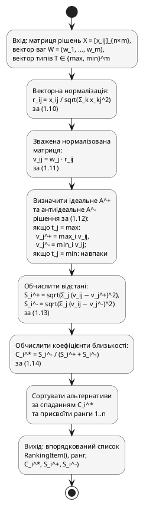

### 2.3.2. Алгоритм TOPSIS

Алгоритм реалізує формули (1.10)–(1.14) підрозділу 1.2.5. Вхід: матриця рішень $X = [x_{ij}]_{n \times m}$ (рядки — локації, стовпці — критерії), вектор ваг $W$ з Алгоритму 2.1, вектор типів оптимізації $T$ ($t_j \in \{\max, \min\}$). Вихід: впорядкований список `RankingItem(i, rank, $C_i^*$, $S_i^+$, $S_i^-$)`. Алгоритм виконується у шість кроків:

1. Векторна нормалізація: $r_{ij} = x_{ij} / \sqrt{\sum_{k=1}^{n} x_{kj}^2}$ за формулою (1.10).
2. Зважена нормалізована матриця: $v_{ij} = w_j \cdot r_{ij}$ за (1.11).
3. Ідеальне $A^+$ і антиідеальне $A^-$ рішення з урахуванням типів `max/min` за (1.12).
4. Евклідові відстані $S_i^+ = \sqrt{\sum_{j}(v_{ij} - v_j^+)^2}$, $S_i^- = \sqrt{\sum_{j}(v_{ij} - v_j^-)^2}$ за (1.13).
5. Коефіцієнти близькості $C_i^* = S_i^- / (S_i^+ + S_i^-)$ за (1.14); $C_i^* \in [0, 1]$.
6. Сортування за спаданням $C_i^*$ і присвоєння рангів $1, \ldots, n$.

Графічне подання алгоритму наведено на рис. 2.10.

![Діаграма активностей алгоритму TOPSIS. Початковий вузол — вхід матриці рішень X, вектора ваг W і вектора типів оптимізації T. Послідовно виконуються шість активностей без розгалужень: векторна нормалізація R за формулою (1.10), побудова зваженої матриці V за формулою (1.11), визначення ідеального A+ і антиідеального A- рішень з урахуванням типу оптимізації за формулою (1.12), обчислення евклідових відстаней S+ і S- за формулою (1.13), обчислення коефіцієнтів близькості C* за формулою (1.14), сортування альтернатив за спаданням C* і присвоєння рангів. Кінцевий вузол — вихід впорядкованого списку RankingItem](images/fig_2_10_topsis_activity.png)

Рис. 2.10. Діаграма активностей алгоритму TOPSIS



**Алгоритм 2.2. Ранжування локацій методом TOPSIS**

```
Вхід:  X = [x_ij]_{n×m} — матриця рішень
       W = (w_1, …, w_m) — нормалізований вектор ваг
       T = (t_1, …, t_m) — вектор типів оптимізації, t_j ∈ {max, min}
Вихід: ranking — впорядкований список RankingItem,
       кожний елемент = (i, rank, C*, S_plus, S_minus)

1:  for j ← 1 to m do
2:      col_norm[j] ← sqrt(Σ_{i=1..n} x_ij^2)
3:  end for
4:  for i ← 1 to n, j ← 1 to m do
5:      R[i, j] ← x_ij / col_norm[j]               // векторна нормалізація (1.10)
6:  end for
7:  for i ← 1 to n, j ← 1 to m do
8:      V[i, j] ← W[j] · R[i, j]                    // зважування (1.11)
9:  end for
10: for j ← 1 to m do
11:     col_max ← max_{i=1..n} V[i, j]
12:     col_min ← min_{i=1..n} V[i, j]
13:     if T[j] = max then
14:         A_plus[j]  ← col_max
15:         A_minus[j] ← col_min
16:     else
17:         A_plus[j]  ← col_min
18:         A_minus[j] ← col_max
19:     end if
20: end for                                         // (1.12)
21: for i ← 1 to n do
22:     S_plus[i]  ← sqrt(Σ_{j=1..m} (V[i, j] − A_plus[j])^2)
23:     S_minus[i] ← sqrt(Σ_{j=1..m} (V[i, j] − A_minus[j])^2)
24: end for                                         // (1.13)
25: for i ← 1 to n do
26:     C_star[i] ← S_minus[i] / (S_plus[i] + S_minus[i])
27: end for                                         // (1.14)
28: indices ← argsort_desc(C_star)                  // упорядкований індекс
29: ranking ← empty_list
30: for r ← 1 to n do
31:     i ← indices[r]
32:     append (i, r, C_star[i], S_plus[i], S_minus[i]) to ranking
33: end for
34: return ranking
```

Складність — $O(nm + n \log n)$; при $n = 12$, $m = 10$ — близько 250 елементарних операцій, що забезпечує час виконання менше 1 мкс — критично для виклику у внутрішньому циклі алгоритму Монте-Карло з $N = 10\,000$ ітерацій.

Алгоритм 2.2 є одночасно самостійним результатом основного сценарію та елементарним кроком циклу МК, формалізованого у наступному підрозділі.
