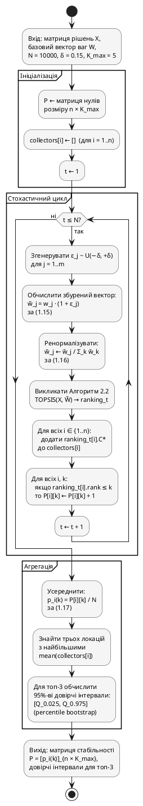

### 2.3.3. Алгоритм аналізу чутливості Монте-Карло

Алгоритм реалізує формули (1.15)–(1.17) підрозділу 1.2.6. Вхід: $X = [x_{ij}]_{n \times m}$, вектор ваг $W$ від Алгоритму 2.1, $N = 10\,000$, $\delta = 0{,}15$, $K_{\max} = 5$. Вихід: матриця $P = [p_i(k)]_{n \times K_{\max}}$ та 95\,\%-ві довірчі інтервали $C_i^*$ для топ-3 локацій. Алгоритм виконується у три фази:

1. **Ініціалізація.** Обнулення матриці лічильників $P_{n \times K_{\max}}$; створення порожніх колекторів значень $C_i^*$ для всіх $n$ локацій; фіксація насіння генератора для відтворюваності.
2. **Стохастичний цикл** ($t = 1, \ldots, N$). На кожній ітерації: (а) генерування $\varepsilon_j \sim U(-\delta, +\delta)$ для $j = 1, \ldots, m$; (б) збурення $\tilde{w}_j = w_j \cdot (1 + \varepsilon_j)$ за (1.15); (в) ренормалізація $\tilde{w}_j \leftarrow \tilde{w}_j / \sum_k \tilde{w}_k$ за (1.16); (г) виклик Алгоритму 2.2 `TOPSIS(X, W̃)`; (д) оновлення лічильників $P$ і колекторів $C^*$.
3. **Агрегація.** Обчислення $p_i(k) = P[i][k] / N$ за (1.17); визначення топ-3 локацій за середніми значеннями $C^*$; побудова 95\%-вих довірчих інтервалів методом percentile bootstrap ($Q_{0.025}$, $Q_{0.975}$).

Графічне подання алгоритму наведено на рис. 2.11.

![Діаграма активностей алгоритму Монте-Карло-аналізу чутливості. Вхід: матриця X, базовий вектор W, параметри N, δ, K_max. Фаза ініціалізації: матриця лічильників P (n × K_max), масив колекторів C*. Зовнішній цикл по t (1..N): генерування ε ~ U(−δ, +δ), обчислення збуреного вектора (1.15), ренормалізація (1.16), виклик TOPSIS (Алг. 2.2), оновлення P і C*. Фаза агрегації: p_i(k) = P[i][k]/N (1.17), визначення топ-3 за середніми C*, 95%-ві довірчі інтервали методом percentile bootstrap. Вихід: матриця P, довірчі інтервали](images/fig_2_11_monte_carlo_activity.png)

Рис. 2.11. Діаграма активностей алгоритму Монте-Карло-аналізу чутливості



**Алгоритм 2.3. Аналіз чутливості ранжування методом Монте-Карло**

```
Вхід:  X = [x_ij]_{n×m} – матриця рішень
       W = (w_1, …, w_m) – базовий нормалізований вектор ваг
       N – кількість ітерацій (за замовчуванням 10000)
       δ – амплітуда збурення (за замовчуванням 0.15)
       K_max – максимальний k для метрик стабільності (за замовчуванням 5)
Вихід: P = [p_i(k)]_{n × K_max} – матриця частот стабільності
       CI = {(i, low_i, high_i)} – 95%-ві довірчі інтервали для топ-3 локацій

1:  for i ← 1 to n, k ← 1 to K_max do
2:      P[i, k] ← 0
3:  end for
4:  for i ← 1 to n do
5:      collectors[i] ← empty_list
6:  end for
7:  for t ← 1 to N do
8:      for j ← 1 to m do
9:          ε_j ← random_uniform(−δ, +δ)
10:         W_tilde[j] ← W[j] · (1 + ε_j)              // (1.15)
11:     end for
12:     S ← Σ_{j=1..m} W_tilde[j]
13:     for j ← 1 to m do
14:         W_tilde[j] ← W_tilde[j] / S                 // (1.16)
15:     end for
16:     ranking_t ← TOPSIS(X, W_tilde)                  // Алгоритм 2.2
17:     for each item ∈ ranking_t do
18:         i ← item.location_id
19:         append item.C_star to collectors[i]
20:         for k ← 1 to K_max do
21:             if item.rank ≤ k then
22:                 P[i, k] ← P[i, k] + 1
23:             end if
24:         end for
25:     end for
26: end for
27: for i ← 1 to n, k ← 1 to K_max do
28:     P[i, k] ← P[i, k] / N                            // (1.17)
29: end for
30: means[i] ← mean(collectors[i])   for i = 1..n
31: top3 ← top-3 indices(means) – за спаданням
32: CI ← empty_list
33: for each i ∈ top3 do
34:     low  ← percentile(collectors[i], 2.5)
35:     high ← percentile(collectors[i], 97.5)
36:     append (i, low, high) to CI
37: end for
38: return (P, CI)
```

Складність – $O(N \cdot n \cdot (m + \log n + K_{\max}))$; при $N = 10\,000$, $n = 12$, $m = 10$, $K_{\max} = 5$ – близько $2{,}3 \cdot 10^6$ операцій (200–500 мс, у межах бюджету 5 с). Порівняння складності трьох алгоритмів – у Табл. 2.5.

Таблиця 2.5 – Порівняльна оцінка обчислювальної складності алгоритмів FAHP, TOPSIS і Монте-Карло

| Алгоритм | Асимптотична складність | Кількість елементарних операцій ($n = 12$, $m = 10$, $N = 10^4$) | Очікувана тривалість виконання |
|---|---|---|---|
| Алгоритм 2.1 (Fuzzy AHP) | $O(m^3)$ | $\sim 10^3$ | 1–10 мкс |
| Алгоритм 2.2 (TOPSIS) | $O(nm + n \log n)$ | $\sim 250$ | < 1 мкс |
| Алгоритм 2.3 (Монте-Карло) | $O(N \cdot n \cdot (m + \log n + K_{\max}))$ | $\sim 2{,}3 \cdot 10^6$ | 200–500 мс |
| Повний цикл FAHP→TOPSIS→MC | (сума попередніх) | $\sim 2{,}3 \cdot 10^6$ | 200–500 мс |

Статистичну коректність забезпечують: симетричний розподіл $U(-\delta, +\delta)$ (незсуненість $E[\tilde{W}] = W$), ренормалізація ($\sum_j \tilde{w}_j = 1$), $N = 10\,000$ ітерацій (стандартна похибка $\leq 1/\sqrt{N} = 0{,}01$). Довірчі інтервали – percentile bootstrap, адекватні для асиметричних розподілів $C^*$ поблизу меж стабільності.
