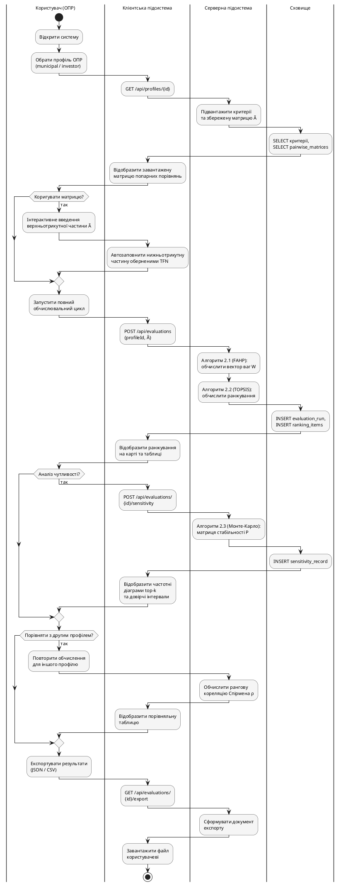

### 2.3.4. Загальний алгоритм функціонування системи

Алгоритми 2.1–2.3 інтегруються у послідовний інтерактивний сценарій з трьома точками рішення ОПР: коригувати чи ні матрицю $\tilde{A}$; запускати аналіз чутливості; виконати повторний цикл для альтернативного профілю. Сценарій містить чотири блоки:

- **Налаштування сеансу** – ОПР обирає профіль, система підвантажує критерії і збережену матрицю $\tilde{A}$; ОПР опційно коригує верхньотрикутну частину, нижньотрикутна заповнюється оберненими TFN автоматично.
- **Обчислювальне ядро** – `POST /api/evaluations` із `{profileId, pairwiseMatrix}`; послідовний виклик Алгоритму 2.1 → 2.2; збереження у `evaluation_runs`, `ranking_items` і відображення на карті.
- **Аналіз чутливості (опційно)** – виклик Алгоритму 2.3; збереження у `sensitivity_records`; відображення частотних діаграм top-$k$ і довірчих інтервалів для топ-3.
- **Порівняння профілів (опційно)** – повторення блоків для другого профілю; обчислення рангової кореляції Спірмена $\rho$; порівняльна таблиця. Завершальний крок – експорт через `GET /api/evaluations/{id}/export` (JSON/CSV).

Загальний алгоритм у нотації Activity Diagram зі swimlane-доріжками наведено на рис. 2.12.

![Діаграма активностей загального сценарію з swimlane-доріжками: Користувач (ОПР), Клієнтська підсистема, Серверна підсистема, Сховище. Користувач – інтерактивні дії і точки рішення. Клієнт – формування і надсилання REST-запитів та відображення результатів. Сервер – виклики Алгоритмів 2.1, 2.2, 2.3 та рангової кореляції Спірмена. Сховище – збереження і підвантаження. Логіка: блок налаштування (вибір профілю, опційне коригування матриці), блок ядра (FAHP→TOPSIS, збереження, відображення ранжування), блок чутливості (опційний Алг. 2.3, частотні діаграми), блок порівняння профілів (опційний повторний цикл, кореляція Спірмена), експорт результатів](images/fig_2_12_general_activity.png)

Рис. 2.12. Діаграма активностей загального сценарію функціонування системи

