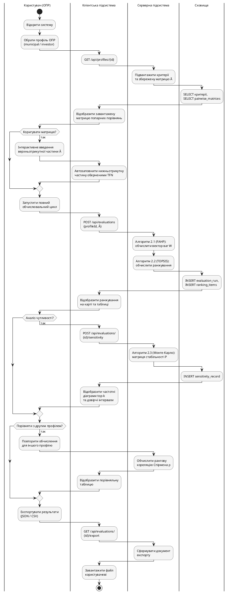

### 2.3.4. Загальний алгоритм функціонування системи

Алгоритми 2.1–2.3, формалізовані у підрозділах 2.3.1–2.3.3, описують окремі обчислювальні методи; у цьому підрозділі показано, як вони інтегруються у послідовний інтерактивний сценарій взаємодії ОПР з системою. Сценарій містить три точки рішення з боку ОПР: (1) коригувати завантажену матрицю суджень $\tilde{A}$ чи використати без змін; (2) запускати аналіз чутливості методом Монте-Карло; (3) виконати повторний цикл для альтернативного профілю і порівняти ранжування. Загальний алгоритм складається з чотирьох логічних блоків:

- **Налаштування сеансу** — ОПР обирає профіль (`municipal` або `investor`); система підвантажує критерії та збережену матрицю $\tilde{A}$; у точці рішення ОПР опційно коригує верхньотрикутну частину матриці, нижньотрикутна заповнюється автоматично оберненими TFN.
- **Обчислювальне ядро** — клієнт надсилає `POST /api/evaluations` із `{profileId, pairwiseMatrix}`; серверна підсистема послідовно виконує Алгоритм 2.1 (FAHP) → Алгоритм 2.2 (TOPSIS); результати зберігаються у `evaluation_runs` і `ranking_items` та відображаються на карті й у таблиці.
- **Аналіз чутливості (опційно)** — у точці рішення ОПР запускає Алгоритм 2.3 (Монте-Карло); результати зберігаються у `sensitivity_records` і відображаються у вигляді частотних діаграм top-$k$ та довірчих інтервалів для топ-3 локацій.
- **Порівняння профілів (опційно)** — ОПР повторює блоки «налаштування — ядро — (опційно) чутливість» для другого профілю; серверна підсистема обчислює рангову кореляцію Спірмена $\rho$ між двома ранжуваннями; клієнт відображає порівняльну таблицю. Завершальний крок — експорт результатів через `GET /api/evaluations/{id}/export` у форматі JSON або CSV.

Графічне подання загального алгоритму у нотації UML Activity Diagram зі swimlane-доріжками наведено на рис. 2.12.

![Діаграма активностей загального сценарію функціонування системи зі swimlane-доріжками за чотирма компонентами: Користувач (ОПР), Клієнтська підсистема, Серверна підсистема, Сховище. У доріжці Користувач — інтерактивні дії та точки рішення. У доріжці Клієнтська підсистема — формування і надсилання REST-запитів, відображення результатів. У доріжці Серверна підсистема — виклики Алгоритмів 2.1, 2.2, 2.3 та обчислення рангової кореляції Спірмена. У доріжці Сховище — операції збереження та підвантаження. Логіка: блок налаштування (вибір профілю, опційне коригування матриці), блок обчислювального ядра (виклик FAHP та TOPSIS, збереження результату, відображення ранжування), блок аналізу чутливості (опційний виклик Алгоритму 2.3 та відображення частотних діаграм), блок порівняння профілів (опційний повторний цикл для іншого профілю та обчислення рангової кореляції Спірмена), завершальний експорт результатів](images/fig_2_12_general_activity.png)

Рис. 2.12. Діаграма активностей загального сценарію функціонування системи

Фізичну архітектуру системи — обчислювальні вузли і комунікаційні протоколи — описано у наступному підрозділі.
