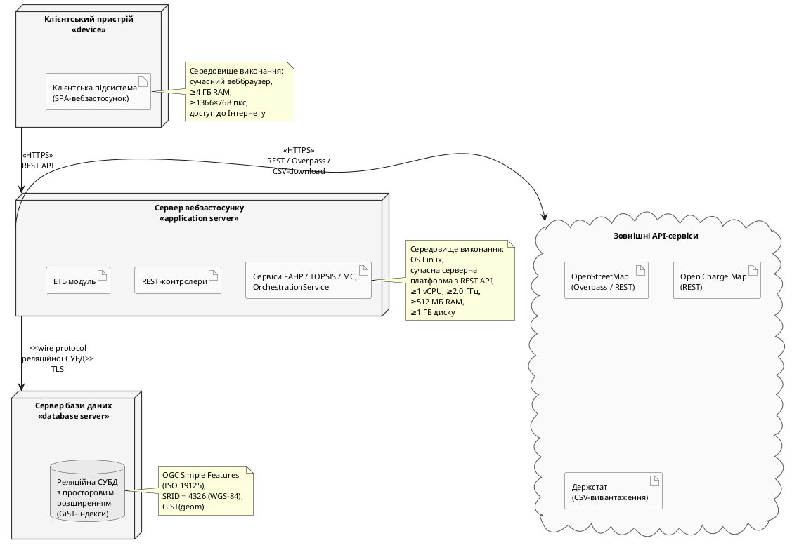

### 2.3.5. Діаграма розгортання

Логічна шарова архітектура (2.1.1) доповнюється фізичною моделлю розгортання – обчислювальні вузли і комунікаційні шляхи. Модель залишається концептуальною: вузли описано в узагальнених термінах фізичних ролей, без прив'язки до конкретних хмарних провайдерів (це – у 3.1.6). Виокремлено чотири вузли: **Клієнтський пристрій** (`<<device>>`) – веббраузер; **Сервер вебзастосунку** (`<<application server>>`) – ОС Linux, мінімум 1 vCPU/512 МБ RAM (підрозділ 1.3); **Сервер бази даних** (`<<database server>>`) – реляційна СУБД з просторовим розширенням і GiST-індексами; **Зовнішні API-сервіси** – OSM, OCM, Держстат. Діаграму наведено на рис. 2.13.

![Діаграма розгортання системи (концептуальний рівень). Чотири вузли і блок зовнішніх сервісів. Клієнтський пристрій (device) – «Клієнтська підсистема» (вебзастосунок). Сервер вебзастосунку (application server) – «REST-контролери», «Сервіси FAHP/TOPSIS/MC, OrchestrationService», «ETL-модуль»; OS Linux, ≥1 vCPU, ≥512 МБ RAM. Сервер БД (database server) – «Сховище даних»: реляційна СУБД з просторовим розширенням і GiST-індексами. «Зовнішні API-сервіси» (cloud) – OSM (Overpass/REST), OCM (REST), Держстат (CSV). Шляхи: клієнт ↔ сервер через HTTPS REST; сервер ↔ БД через wire protocol з TLS; сервер ↔ зовнішні сервіси через HTTPS](images/fig_2_13_deployment_diagram.png)

Рис. 2.13. Діаграма розгортання системи

Комунікація між вузлами – три типи протоколів: HTTPS REST (клієнт ↔ сервер вебзастосунку, контракт із 2.1.6); wire protocol СУБД з TLS (сервер ↔ БД); HTTPS до зовнішніх сервісів (REST для OSM/OCM, CSV для Держстату).

Ключове проєктне рішення – розділення сервера обчислень і сервера БД на окремі вузли як передумова горизонтального масштабування до 1000+ локацій: кілька екземплярів сервера вебзастосунку розгортаються за балансувальником зі спільним сервером БД без архітектурних змін.
