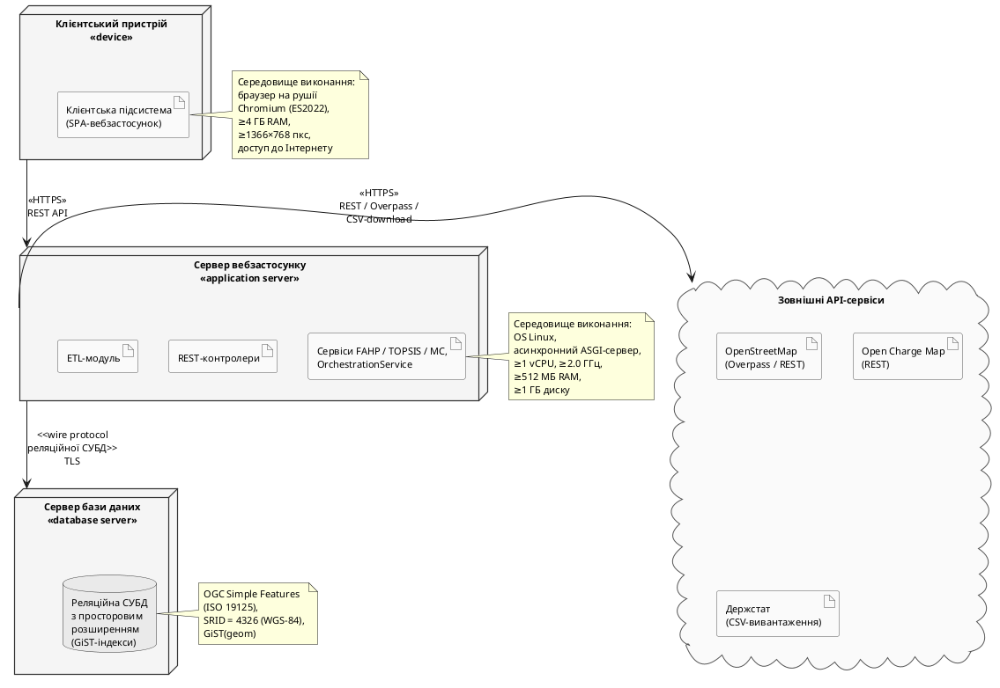

### 2.3.5. Діаграма розгортання

Логічна шарова архітектура, описана у підрозділі 2.1.1, доповнюється фізичною моделлю розгортання — описом обчислювальних вузлів і комунікаційних шляхів між ними. Модель виконана у нотації UML Deployment Diagram і залишається концептуальною: вузли описуються в узагальнених термінах фізичних ролей без прив'язки до конкретних хмарних провайдерів — ці рішення розглянуто у підрозділі 3.1.6. Виокремлено чотири вузли: **Клієнтський пристрій** (`<<device>>`) — веббраузер на рушії Chromium стандарту ECMAScript 2022; **Сервер вебзастосунку** (`<<application server>>`) — ОС Linux, ASGI-сервер, мінімум 1 vCPU/512 МБ RAM (підрозділ 1.3); **Сервер бази даних** (`<<database server>>`) — реляційна СУБД з просторовим розширенням і GiST-індексами; **Зовнішні API-сервіси** — OSM (Overpass/REST), OCM (REST), Держстат (CSV-вивантаження). Діаграму розгортання наведено на рис. 2.13.

![Діаграма розгортання системи на концептуальному рівні. Чотири основні вузли і один блок зовнішніх сервісів. Клієнтський пристрій (стереотип device) містить артефакт «Клієнтська підсистема» з виконавчим середовищем — браузер на рушії Chromium стандарту ECMAScript 2022. Сервер вебзастосунку (стереотип application server) містить артефакт «Серверна підсистема» з REST-контролерами, сервісами FAHP/TOPSIS/MC, ETL-модулем; виконавче середовище — OS Linux, асинхронний ASGI-сервер, ≥1 vCPU, ≥512 МБ RAM. Сервер бази даних (стереотип database server) містить артефакт «Сховище даних» — реляційна СУБД з просторовим розширенням, GiST-індекси на просторових колонках. Блок «Зовнішні API-сервіси» (стереотип cloud) містить три артефакти: OpenStreetMap (Overpass і REST), Open Charge Map (REST), Держстат (CSV-вивантаження). Комунікаційні шляхи: клієнтський пристрій ↔ сервер вебзастосунку через HTTPS з REST API; сервер вебзастосунку ↔ сервер БД через wire protocol реляційної СУБД з TLS-шифруванням; сервер вебзастосунку ↔ зовнішні сервіси через HTTPS](images/fig_2_13_deployment_diagram.png)

Рис. 2.13. Діаграма розгортання системи

Комунікація між вузлами реалізується трьома типами протоколів: HTTPS з REST API між клієнтом і сервером вебзастосунку (контракт із підрозділу 2.1.6); wire protocol реляційної СУБД з TLS-шифруванням між сервером застосунку і сервером БД; HTTPS між сервером застосунку і зовнішніми сервісами (REST для OSM/OCM, завантаження CSV для Держстату).

Ключовим проєктним рішенням є розділення сервера обчислень і сервера БД на окремі вузли: це необхідна передумова горизонтального масштабування при розширенні задачі до 1000+ локацій — кілька екземплярів сервера вебзастосунку розгортаються за балансувальником навантаження зі спільним сервером БД без архітектурних змін у системі.

Підрозділ завершує опис проєктування системи. У Розділі 2 сукупно представлено: статичну й динамічну архітектуру у вигляді UML-діаграм (підрозділи 2.1.1–2.1.5); специфікацію REST API (підрозділ 2.1.6); концептуальну й логічну моделі БД та ETL-потоки (підрозділи 2.2.1–2.2.3); алгоритмічну формалізацію FAHP–TOPSIS–МК з псевдокодом (підрозділи 2.3.1–2.3.3); загальний сценарій функціонування (підрозділ 2.3.4) і концептуальну модель розгортання (підрозділ 2.3.5). Сукупність проєктних рішень утворює завершений опис системи, що становить основу для реалізаційних рішень Розділу 3.
