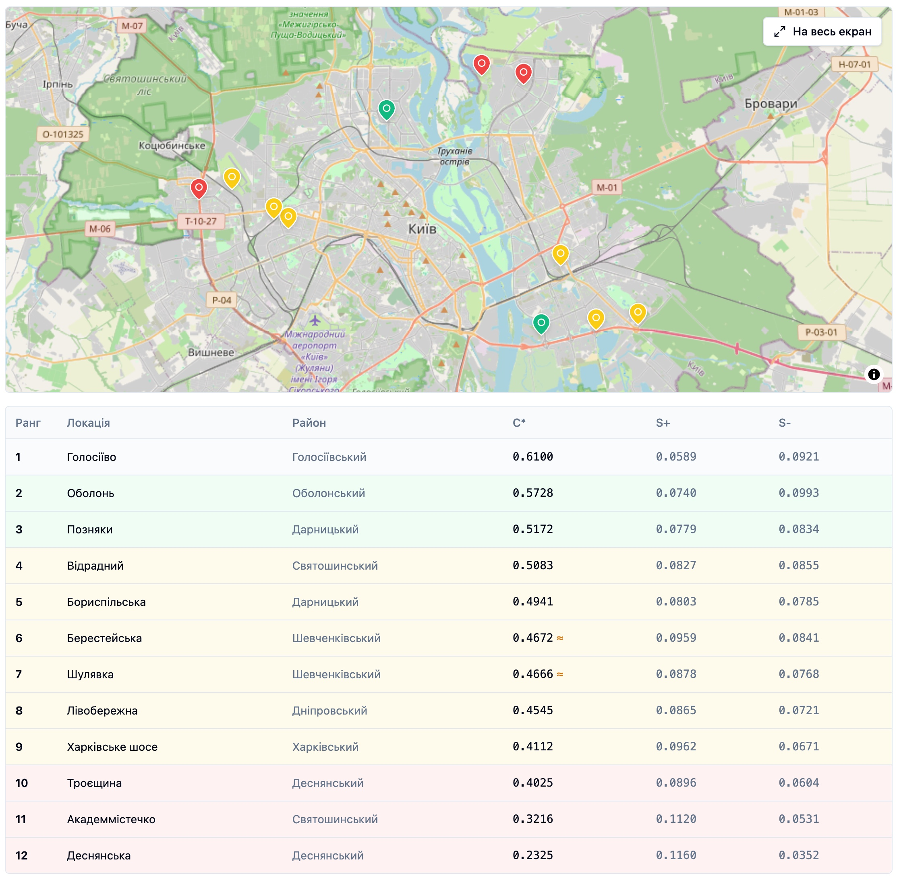
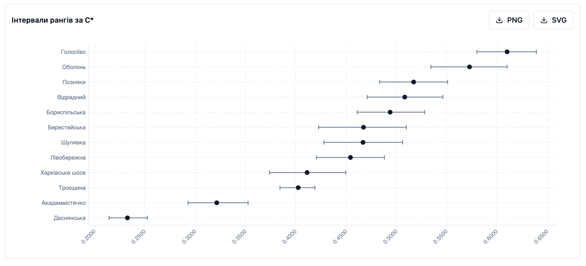
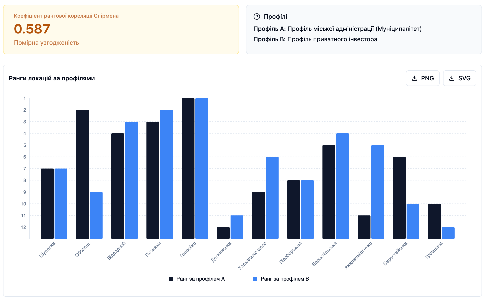

## 3.2. Тестування та аналіз результатів роботи системи вибору локацій зарядних станцій

Перевірку комплексу складають функціональне тестування, що підтверджує коректність роботи системи, та обчислювальний експеримент на модельних даних, що оцінює ефективність процедури.

Функціональне тестування проведено за набором тест-кейсів, які охоплюють основні сценарії роботи – від обчислення ваг критеріїв до експорту результатів. Перелік тест-кейсів з алгоритмами дій, очікуваними і фактичними результатами наведено в додатку Б, усі тест-кейси пройдено успішно. Окремо коректність обчислювального ядра звірено з контрольними прикладами з літератури. Отримані значення збіглися з очікуваними в межах числової похибки.

Обчислювальний експеримент проведено на модельному наборі даних. Як територію аналізу обрано м. Київ – найбільше місто України з найбільшим парком електромобілів і нерівномірним розподілом наявних зарядних точок між районами, що робить його показовим випадком задачі. Дванадцять локацій-кандидатів відповідають реальним об'єктам у районах м. Києва (назви та координати WGS-84) і дібрані так, щоб охопити різні адміністративні райони міст. Такої кількості достатньо для змістовного ранжування й аналізу стійкості рангів і водночас вона лишається зручною для відтворення експерименту. Значення дев'яти критеріїв згенеровано синтетично – рівномірним відбором у межах правдоподібних для кожного критерію діапазонів із фіксованим зерном генератора для відтворюваності. Хід обчислень показано на профілі міської адміністрації. Другий профіль – приватного інвестора, залучається наприкінці лише для порівняння ранжувань.

Ваги критеріїв для профілю міської адміністрації, обчислені методом FAHP, наведено в табл. 3.2. Матриця попарних порівнянь задовольняє умову узгодженості $CR \leq 0{,}10$.

Таблиця 3.2. – Ваги критеріїв для профілю міської адміністрації

| Критерій | Вага |
|---|---|
| Щільність населення | 0,2513 |
| Зелені зони | 0,1686 |
| Середньодобовий трафік | 0,1003 |
| Потужність електромережі | 0,1003 |
| Відстань до наявної станції | 0,1003 |
| Відстань до підстанції | 0,0847 |
| Вартість землі | 0,0847 |
| Паркомісця | 0,0847 |
| Доходи населення | 0,0254 |

Найбільшу вагу мають щільність населення і зелені зони, що відповідає пріоритетам профілю. Ранжування локацій за коефіцієнтом близькості $C_i^*$ наведено в табл. 3.3, а його подання у клієнтській частині – на рис. 3.2.

Таблиця 3.3. – Ранжування локацій-кандидатів для профілю міської адміністрації

| Локація | Район | $C_i^*$ | Ранг |
|---|---|---|---|
| Голосіїво | Голосіївський | 0,6100 | 1 |
| Оболонь | Оболонський | 0,5728 | 2 |
| Позняки | Дарницький | 0,5172 | 3 |
| Відрадний | Святошинський | 0,5083 | 4 |
| Бориспільська | Дарницький | 0,4941 | 5 |
| Берестейська | Шевченківський | 0,4672 | 6 |
| Шулявка | Шевченківський | 0,4666 | 7 |
| Лівобережна | Дніпровський | 0,4545 | 8 |
| Харківське шосе | Харківський | 0,4112 | 9 |
| Троєщина | Деснянський | 0,4025 | 10 |
| Академмістечко | Святошинський | 0,3216 | 11 |
| Деснянська | Деснянський | 0,2325 | 12 |

Рис. 3.2. Ранжування локацій-кандидатів для профілю міської адміністрації

Стійкість ранжування оцінено методом Монте-Карло за $N = 10\,000$ ітерацій збурення ваг з амплітудою $\delta = 0{,}15$. Індекс прийнятності рангів $p_i(k)$ визначає частку симуляцій, у яких локація $i$ посіла місце не нижче $k$-го. Матрицю індексів для порогів $k \in \{1,\,3,\,5\}$ наведено в табл. 3.4.

Таблиця 3.4. – Матриця індексів прийнятності рангів ($N = 10\,000$)

| Локація | $p_i(1)$ | $p_i(3)$ | $p_i(5)$ |
|---|---|---|---|
| Голосіїво | 100,0 % | 100,0 % | 100,0 % |
| Оболонь | 0,0 % | 95,6 % | 100,0 % |
| Позняки | 0,0 % | 77,1 % | 100,0 % |
| Відрадний | 0,0 % | 24,3 % | 98,9 % |
| Лівобережна | 0,0 % | 2,9 % | 13,8 % |
| Бориспільська | 0,0 % | 0,1 % | 86,3 % |
| Берестейська | 0,0 % | 0,0 % | 1,0 % |
| Шулявка | 0,0 % | 0,0 % | 0,0 % |
| Деснянська | 0,0 % | 0,0 % | 0,0 % |
| Харківське шосе | 0,0 % | 0,0 % | 0,0 % |
| Академмістечко | 0,0 % | 0,0 % | 0,0 % |
| Троєщина | 0,0 % | 0,0 % | 0,0 % |

Голосіїво абсолютно домінує: у всіх 10 000 симуляціях воно посідає перший ранг ($p_i(1) = 100{,}0\,\%$), що свідчить про виняткову стійкість лідера за даного профілю ОПР. Друге й третє місця впевнено утримують Оболонь ($p_i(3) = 95{,}6\,\%$) та Позняки ($p_i(3) = 77{,}1\,\%$). Відрадний гарантовано входить до п'ятірки ($p_i(5) = 98{,}9\,\%$), але рідко потрапляє до трійки ($p_i(3) = 24{,}3\,\%$). Бориспільська займає нестабільну позицію між рангами 4 і 5: попри майже гарантоване потрапляння до топ-6 ($p_i(5) = 86{,}3\,\%$), до трійки вона не входить ($p_i(3) \approx 0\,\%$). Решта локацій стабільно займають нижню половину ранжування незалежно від збурень ваг. Інтервали рангів за $C_i^*$ відображено на рис. 3.3.

Рис. 3.3. Інтервали рангів локацій за $C_i^*$ – аналіз чутливості методом Монте-Карло

Щоб оцінити чутливість процедури до пріоритетів ОПР, ту саму матрицю рішень оцінено за другим профілем – приватного інвестора, який надає перевагу середньодобовому трафіку, доходам населення і близькості до наявних станцій. Ранги локацій за двома профілями зіставлено в табл. 3.5.

Таблиця 3.5. – Порівняння рангів локацій за двома профілями ОПР

| Локація | Ранг (муніципалітет) | Ранг (інвестор) | $\Delta$ |
|---|---|---|---|
| Голосіїво | 1 | 1 | 0 |
| Оболонь | 2 | 9 | −7 |
| Позняки | 3 | 2 | +1 |
| Відрадний | 4 | 3 | +1 |
| Бориспільська | 5 | 4 | +1 |
| Берестейська | 6 | 10 | −4 |
| Шулявка | 7 | 7 | 0 |
| Лівобережна | 8 | 8 | 0 |
| Харківське шосе | 9 | 6 | +3 |
| Троєщина | 10 | 12 | −2 |
| Академмістечко | 11 | 5 | +6 |
| Деснянська | 12 | 11 | +1 |

Збіг ранжувань оцінено коефіцієнтом рангової кореляції Спірмена, який становить $\rho \approx 0{,}587$ – помірна додатна кореляція, тобто профілі дають помітно різні впорядкування в середній і нижній частинах списку. Голосіїво однаково очолює обидва ранжування, тоді як Оболонь опускається з другого місця для муніципалітету на дев'яте для інвестора ($\Delta = -7$), а Академмістечко, навпаки, піднімається з одинадцятого на п'яте ($\Delta = +6$). Результат порівняння у клієнтській частині показано на рис. 3.4.

Рис. 3.4. Порівняння ранжувань двох профілів ОПР

Результати підтверджують ефективність обчислювальної процедури. Гібридна схема дає узгоджені ваги, впорядковує локації за коефіцієнтом близькості і виявляє стійке ядро лідерів за індексами прийнятності рангів, а помірна узгодженість Спірмена показує, що процедура чутлива до пріоритетів ОПР і не зводить два різні профілі до однакового результату.
